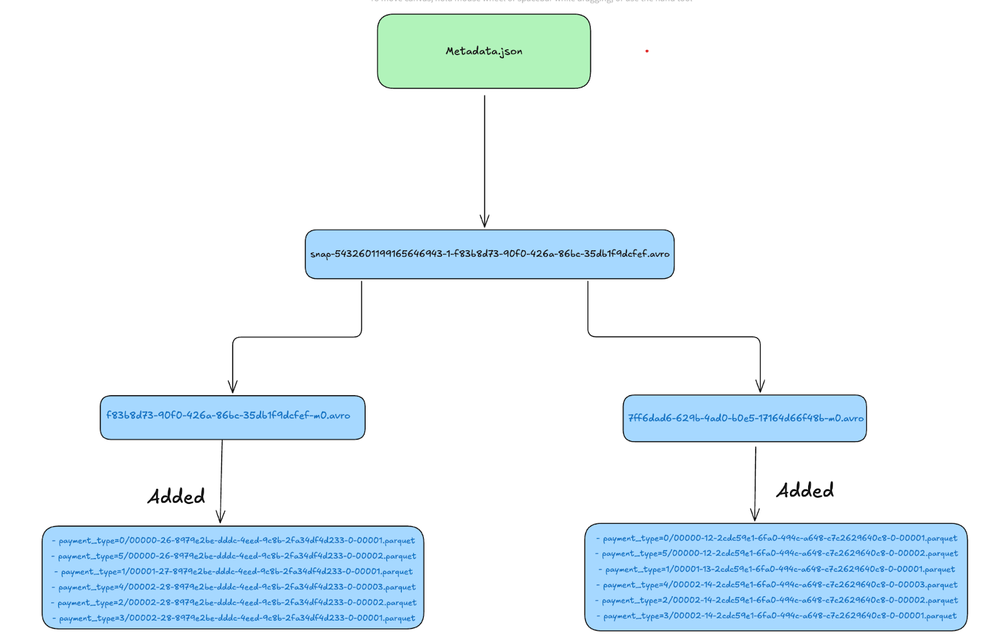
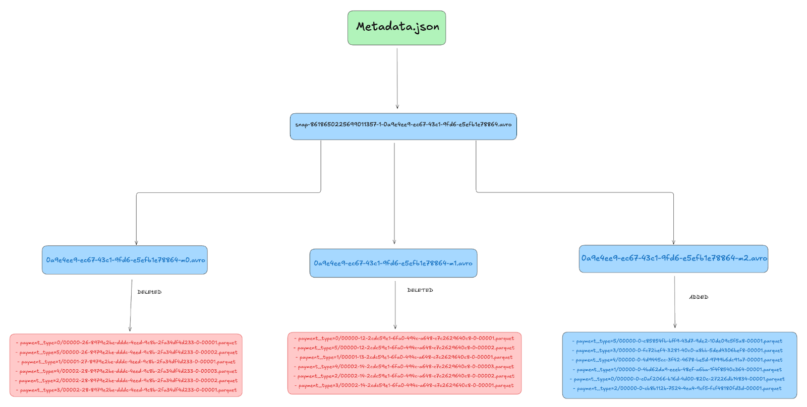
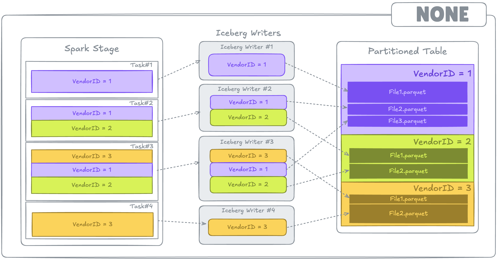
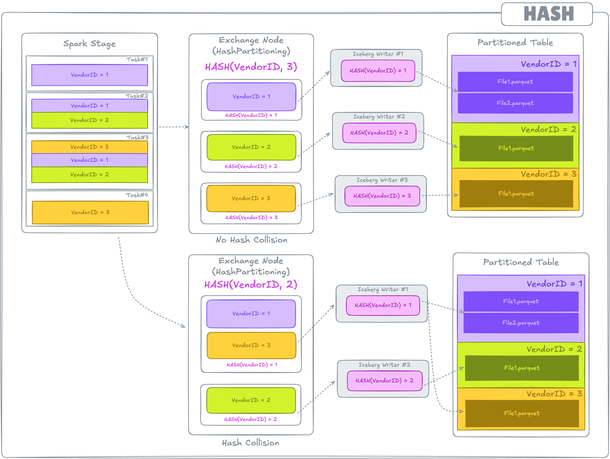
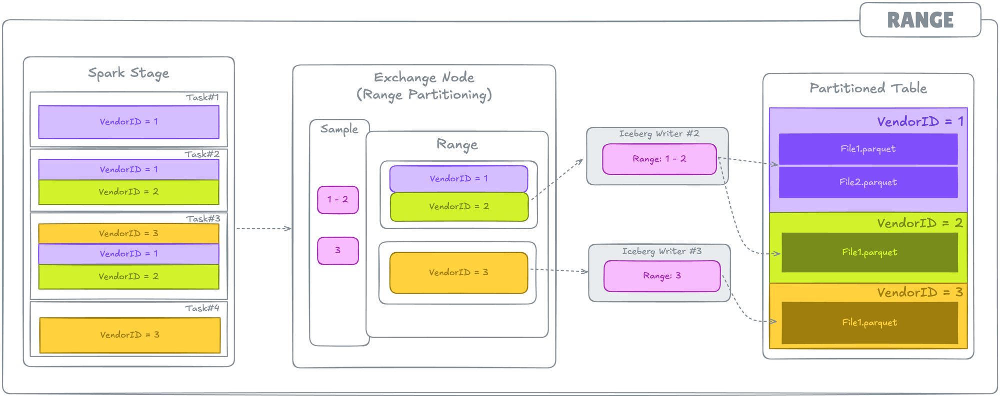
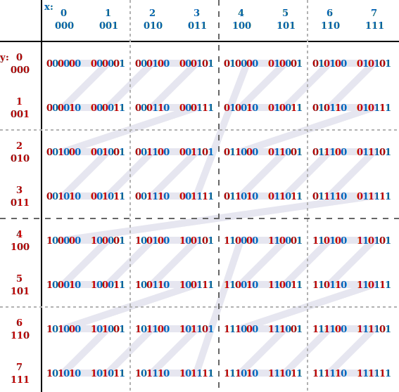
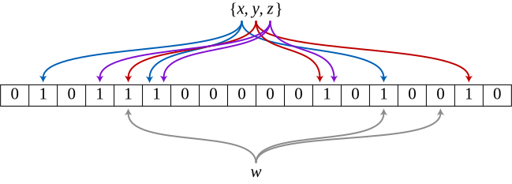

# Iceberg 스키마 설계 가이드

## 문서 정보

| 항목 | 내용 |
|------|------|
| 작성 목적 | Iceberg 테이블의 파티션, 정렬, 스키마 설계에 대한 근거 기반 가이드 |
| 대상 독자 | 데이터 엔지니어, 운영팀 |
| 환경 | Kubernetes 클러스터, S3(MinIO), Spark 4.1.1, Iceberg 1.10.1, Airflow 3.1.7 |
| 최종 수정일 | 2026-03-18 |

### 목차

- [1. 개요](#1-개요) — 대상 테이블, 조회 패턴
- [2. 파티션 설계](#2-파티션-설계) — Hidden Partitioning, 트랜스폼, 설계 기준
- [3. Bucket](#3-bucket) — bucket 트랜스폼, 적용 시나리오
- [4. Sort Order 설계](#4-sort-order-설계) — 정렬 효과, distribution-mode, 트레이드오프
- [5. Z-ordering](#5-z-ordering) — 다차원 정렬, 비교, 적용 검토
- [6. 추가 스키마 설계 고려사항](#6-추가-스키마-설계-고려사항) — 데이터 타입, Nullable, Column Metrics, Bloom Filter, 테이블 속성
- [7. 최종 설계 방향](#7-최종-설계-방향) — 파티션 전략 비교, 설계 항목별 정리, DDL 예시
- [8. 참고 자료](#8-참고-자료)

---

## 1. 개요

### 1.1 대상 테이블 스키마

> **참고**: 테이블명과 컬럼명은 도메인 정보이므로 익명화된 이름을 사용한다.

**테이블: TABLE_A**

| 항목 | 값 |
|------|----|
| 컬럼 수 | 19개 |
| 데이터 타입 | timestamp_ntz, string, double, integer, array<integer>, array<double>, array<string> |
| 배치 주기 | 10분 |
| 1회 적재량 | ~8GB (avro), ~6.5GB (Parquet/Iceberg) |
| 일 적재량 | ~851GB (850,695 MB 실측) |

**전체 컬럼 스키마**

| # | 컬럼명 | 데이터 타입 | 용도 |
|---|--------|-----------|------|
| 1 | ts | timestamp_ntz | 파티션 1 — `day(ts)` |
| 2 | par_a | string | 파티션 2 — identity |
| 3 | par_b | string | 파티션 3 — identity |
| 4 | sort_a | string | Sort Order 1순위 |
| 5 | sort_b | string | Sort Order 2순위 |
| 6 | sort_c | string | Sort Order 3순위 |
| 7 | id_1 | string | 식별자 |
| 8 | val_1 | double | 값 |
| 9 | val_2 | double | 값 |
| 10 | cnt_1 | integer | 카운트 |
| 11 | cnt_2 | integer | 카운트 |
| 12 | val_arr_1 | array&lt;integer&gt; | 배열 값 |
| 13 | val_arr_2 | array&lt;integer&gt; | 배열 값 |
| 14 | val_arr_3 | array&lt;double&gt; | 배열 값 |
| 15 | val_arr_4 | array&lt;double&gt; | 배열 값 |
| 16 | yn_arr | array&lt;string&gt; | 배열 값 |
| 17 | tval_1 | array&lt;double&gt; | 배열 값 |
| 18 | tval_2 | array&lt;double&gt; | 배열 값 |
| 19 | tval_3 | array&lt;double&gt; | 배열 값 |

**현재 설정**

| 항목 | 설정 |
|------|------|
| 파티션 | `day(ts)`, `par_a`, `par_b` |
| Sort Order | `sort_a`, `sort_b`, `sort_c` ASC NULLS FIRST |
| `write.distribution-mode` | `range` |

**컬럼별 Cardinality 및 용도**

| 마스킹명 | 용도 | Cardinality | 비고 |
|---------|------|-------------|------|
| par_a | 파티션 키 | 4 | identity |
| par_b | 파티션 키 | 248 (par_a별 42~72) | identity |
| sort_a | Sort Order 1순위 | 31,697 | WHERE 절 등가 조건 |
| sort_b | Sort Order 2순위 | 25,820 | WHERE 절 등가 조건 |
| sort_c | Sort Order 3순위 | 563,691 | WHERE 절 등가 조건 |

### 1.2 조회 패턴

TABLE_A의 주요 조회는 **다차원 필터** 패턴이다. WHERE 절에는 `date(ts)`, `par_a`, `par_b`, `sort_a`, `sort_b`, `sort_c`가 사용된다.

```sql
SELECT * FROM TABLE_A
WHERE date(ts) = timestamp '2026-03-11'
  AND par_a = 'A'
  AND par_b = 'value0'
  AND sort_a = 'value1'
  AND sort_b = 'value2'
  AND sort_c = 'value3';
```

**실제 조회 패턴 분석 결과**

UI에서 사용하는 Trino 쿼리를 분석한 결과 (UI 기능상 WHERE 절에 추가 가능한 조건 기준):

| 절 | 사용 컬럼 | 빈도 | 조건 유형 | 비고 |
|----|----------|------|----------|------|
| WHERE | ts | 항상 | `date(ts) = ...`, `date(ts) IN (...)` | 모든 쿼리에 포함, `day(ts)` 파티션으로 프루닝 |
| WHERE | par_a | 항상 | 등가 (`=`, `IN`) | 파티션 프루닝 유효 |
| WHERE | sort_a | 높음 | 등가 (`=`, `IN`) | Sort Order 1순위 |
| WHERE | sort_b | 높음 | 등가 (`=`, `IN`) | Sort Order 2순위 |
| WHERE | sort_c | 있음 | 등가 (`=`, `IN`) | Sort Order 3순위 |
| WHERE | par_b | 항상 | 등가 (`=`, `IN`) | 파티션 프루닝 유효. 단, 파티션 분포 불균등 (Skew) 존재 |

스키마 설계의 핵심 목표는 이러한 다차원 필터 조회에서 **불필요한 파일 읽기를 최소화**(Data Skipping)하는 것이다. 파티션 프루닝은 `day(ts)` + `par_a` + `par_b`에서 작동하며, **sort_a, sort_b, sort_c의 Sort Order + Data Skipping이 추가 최적화 수단**이다.

---

## 2. 파티션 설계

> 참고: [Iceberg Partitioning](https://iceberg.apache.org/docs/latest/partitioning/) · [Partition Transforms Spec](https://iceberg.apache.org/spec/#partition-transforms)

### 2.1 Iceberg Hidden Partitioning 개념

Iceberg는 **Hidden Partitioning**을 사용한다. Hive 파티셔닝과의 핵심 차이:

| 구분 | Hive 파티셔닝 | Iceberg Hidden Partitioning |
|------|--------------|---------------------------|
| 파티션 컬럼 | 별도 컬럼으로 스키마에 노출 | 원본 컬럼에 트랜스폼 적용, 스키마 변경 없음 |
| 쿼리 작성 | 파티션 컬럼을 직접 지정해야 함 (`dt='2026-03-15'`) | 원본 컬럼으로 쿼리 (`ts >= '2026-03-15'`), Iceberg가 자동 변환 |
| 파티션 변경 | 테이블 재생성 + 데이터 재적재 필요 | **Partition Evolution**: 메타데이터만 변경, 기존 데이터 유지 |
| 사용자 실수 | 파티션 컬럼 누락 시 full scan | 자동 파티션 프루닝, 실수 방지 |

**핵심 장점**: 사용자는 `ts` 컬럼으로 쿼리하면 되고, Iceberg가 내부적으로 `day(ts)` 파티션을 이용해 불필요한 파일을 건너뛴다.

```sql
-- Hive: 사용자가 파티션 컬럼(dt)을 알고 직접 지정해야 함
SELECT * FROM table WHERE dt = '2026-03-15';

-- Iceberg: 원본 컬럼(ts)으로 쿼리, 자동 파티션 프루닝
SELECT * FROM table WHERE ts >= '2026-03-15' AND ts < '2026-03-16';
```

### 2.2 파티션 트랜스폼 종류 및 선택 기준

Iceberg가 제공하는 파티션 트랜스폼:

| 트랜스폼 | 입력 타입 | 결과 | 설명 | 적합한 경우 |
|----------|----------|------|------|-----------|
| `identity` | 모든 타입 | 원본 값 그대로 | 원본 값 = 파티션 값 | Cardinality가 낮은 컬럼 (수십 이하) |
| `day(col)` | timestamp, date | 날짜 (정수) | 일 단위 파티션 | 일 단위 시계열 조회 |
| `month(col)` | timestamp, date | 월 (정수) | 월 단위 파티션 | 월 단위 조회, 일 단위 대비 파티션 수 감소 |
| `year(col)` | timestamp, date | 연도 (정수) | 연 단위 파티션 | 장기 보관 데이터, 연 단위 조회 |
| `hour(col)` | timestamp | 시간 (정수) | 시 단위 파티션 | 실시간/스트리밍, 시간 단위 세밀 조회 |
| `bucket(N, col)` | 모든 타입 | 0~N-1 해시값 | N개 버킷으로 해시 분배 | 고 Cardinality + 등가 조건 조회 |
| `truncate(W, col)` | string, int, long, decimal | 잘린 값 | 문자열은 앞 W자, 숫자는 W 단위 절삭 | 접두사/범위 기반 조회 |
| `void` | 모든 타입 | 항상 null | 파티션 비활성화 | Partition Evolution 시 기존 파티션 제거 |

### 2.3 파티션 설계 판단 기준

파티션 설계 시 고려해야 할 3가지 핵심 기준:

**기준 1: 파티션당 데이터 크기**

| 항목 | 권장 |
|------|------|
| 파티션당 최소 데이터 | 100MB 이상 |
| 파티션당 최적 데이터 | 수백 MB ~ 수 GB |
| small file 위험 기준 | 파티션당 100MB 미만이 다수 발생 |

파티션이 지나치게 세분화되면 파일 수가 급증하여 **small file 문제**가 발생한다. 메타데이터 오버헤드 증가, 파일 열기/닫기 비용 증가로 읽기·쓰기 성능이 모두 저하된다.

**기준 1-1: 배치 빈도와 파티션 조합의 곱셈 효과**

10분 배치 환경에서는 파티션 수가 파일 수에 **배치 횟수만큼 곱해진다**:

```
일일 파일 수 = 배치 횟수/일 × 배치당 파티션 조합 수 × 파티션당 파일 수

TABLE_A 실측값:
  배치 횟수: 144회/일
  파티션 조합: day(1) × par_a(4) × par_b(42~72) = 248개
  ─────────────────────────────────────────────────
  실측 파일 수: ~23,789 파일/일 (Compaction 전) ← ⚠️ 주의, 정기 Compaction 필수
  이론값(144 × 248 = 35,712)보다 적은 이유는 모든 배치에 248개 파티션 조합 전체에 데이터가 분배되지 않기 때문
```

**파일 수 임계값 기준** (S3 + Iceberg 메타데이터 기준):

| 일일 파일 수 | 수준 | 영향 |
|-------------|------|------|
| ~5,000 이하 | ✅ 안전 | 메타데이터 부하 미미 |
| 5,000~30,000 | ⚠️ 주의 | 시간당 Compaction 권장. 쿼리 플래닝 시간 증가 시작 |
| 30,000 이상 | ❌ 위험 | 필수 Compaction + 파티션 키 재설계 검토. S3 ListObjects 비용 급증 |

> **TABLE_A**: 일일 ~23,789 파일로 ⚠️ 주의 구간. 정기 Compaction이 필수이며, 이미 운영 계획에 포함되어 있다 (1시간 + 1일 단위 배치).

**Compaction 실측 결과** (참고: [Iceberg Metadata Evolution After Compaction — e6data](https://www.e6data.com/blog/iceberg-metadata-evolution-after-compaction))

> | Compaction 전 | Compaction 후 |
> |-------------|-------------|
> |  |  |

1일치 데이터 기준 Compaction 테스트 결과:

| 항목 | Compaction 전 | Compaction 후 | 변화 |
|------|-------------|-------------|------|
| 데이터 파일 수 | 23,789개 | 1,834개 | **92% 감소** |
| 데이터 크기 | 850,955 MB | 850,695 MB | 0.03% 감소 (메타데이터 오버헤드만 제거) |
| 평균 파일 크기 | ~36 MB | **~464 MB** | target-file-size(512MB)에 근접 |

> **분석**: Compaction 후 1,834개 파일은 850,695 MB / 512 MB ≈ 1,661개(이론 최솟값)에 근접한다. 차이(173개)는 데이터가 512MB에 못 미치는 소규모 파티션 조합 때문이며, 이는 par_b의 Skew(하위 ~190개 조합이 소량)에 기인한다.

**기준 2: 쿼리 패턴과의 정합성**

| 조건 | 파티션 효과 |
|------|-----------|
| WHERE 절에 파티션 컬럼 포함 | ✅ 파티션 프루닝으로 scan 범위 축소 |
| WHERE 절에 파티션 컬럼 미포함 | ❌ 프루닝 불가, 전체 파티션 scan |

**파티션 키는 WHERE 절에 가장 자주 등장하는 컬럼**이어야 한다. 다만 파티션은 프루닝 외에도 다음 역할을 수행한다:
- **데이터 조직화**: 물리적 파일 그룹핑으로 Compaction, 삭제, 보관 관리 용이
- **쓰기 분산**: 파티션별 병렬 쓰기로 처리량 확보

따라서 파티션 키 선택 시 **프루닝 효과 + 데이터 조직화 이점 + 운영 비용(파일 수)을 종합적으로 판단**해야 한다.

**기준 3: Cardinality**

| Cardinality | 권장 트랜스폼 | 예시 |
|-----------|-------------|------|
| 매우 낮음 (2~10) | `identity` | status, region |
| 중간 (수십~수백) | `identity` 또는 `bucket` | category, department |
| 높음 (수천 이상) | `bucket(N)` 또는 `truncate(W)` | user_id, order_id |
| 시계열 | `day`/`month`/`hour` | timestamp 컬럼 |

### 2.4 TABLE_A 적용: day(ts), par_a, par_b 근거

| 파티션 | 트랜스폼 | 근거 |
|--------|---------|------|
| `day(ts)` | 시간 트랜스폼 | 모든 조회에 `date(ts) = ...` 조건 포함 → ✅ 파티션 프루닝 유효. 일 적재량 ~851GB이므로 `day` 단위가 적정 |
| `par_a` | identity | Cardinality 4. WHERE 절에 항상 포함되어 파티션 프루닝 유효. 매우 낮은 Cardinality로 identity 최적 |
| `par_b` | identity | par_a별 42~72개, 전체 조합 248개. WHERE 절에 항상 포함되어 파티션 프루닝 유효. 파티션 분포 불균등(Skew) 존재하나 Compaction으로 관리. 정기 Compaction 필수 |

**day(ts) 선택 이유**

```
hour(ts) → 파티션 수: 24개/일 × 365일 = 8,760개/년 → 과다
day(ts)  → 파티션 수: 365개/년 → ✅ 적정
month(ts)→ 파티션 수: 12개/년 → 월 적재량 ~26TB, 프루닝 효과 부족
```

`day(ts)`는 일 단위 조회 패턴에 정합하며, 파티션당 데이터 크기도 적정하다.

**실측 Cardinality 및 파티션 현황**

검증 쿼리:

```sql
-- 1) 파티션 조합별 현황 (Iceberg files 메타데이터)
SELECT
    partition,
    COUNT(*) AS file_count,
    SUM(record_count) AS total_records,
    SUM(file_size_in_bytes) / 1024 / 1024 AS total_size_mb
FROM catalog.db.TABLE_A.files
GROUP BY partition
ORDER BY total_size_mb DESC;

-- 2) par_a별 후보 컬럼 Cardinality 비교
SELECT
    par_a,
    COUNT(DISTINCT par_b) AS par_b_card,
    COUNT(DISTINCT par_c) AS par_c_card,
    COUNT(DISTINCT par_d) AS par_d_card,
    COUNT(*) AS total_rows
FROM catalog.db.TABLE_A
WHERE date(ts) = '2026-03-15'
GROUP BY par_a
ORDER BY par_a;
```

**par_a별 Cardinality 결과**

| par_a | par_b | par_c | par_d |
|-------|-------|-------|-------|
| A | 42 | 677 | 179 |
| B | 72 | 11,918 | 704 |
| C | 70 | 8,245 | 523 |
| D | 64 | 5,102 | 381 |

- **par_a**: 4개 (A, B, C, D) — 매우 낮음, identity 최적
- **par_b**: par_a별 42~72개 (전체 조합 248개 = 42+72+70+64) — 중간, identity 유지
- **par_c**: par_a별 677~11,918개 — 고 Cardinality, identity 불가
- **par_d**: par_a별 179~704개 — 중 Cardinality, identity 불가

**files 메타데이터 결과 (248개 파티션 조합, day × par_a × par_b)**

아래는 Compaction 후 files 메타데이터 결과이다.

| 순위 범위 | 크기 범위 | 파일 수 | 특징 |
|----------|----------|--------|------|
| 1~50위 | 1~203GB | 다수 | ✅ 충분한 크기, 대부분의 데이터 차지 |
| 50~60위 | 0.001~1GB | 소수 | ⚠️ target-file-size(512MB) 미만 포함 |
| 60위 이후 | 0.001GB 이하 | 전부 1개 | 데이터 자체가 적은 파티션. Compaction 후에도 변하지 않음 |

> **진단**: 248개 조합으로 ⚠️ 주의 구간. 상위 50개가 대부분의 데이터를 차지하여 **Skew가 존재**하며, 하위 ~190개 파티션은 데이터 자체가 적어(0.001GB 이하) Compaction 후에도 소형 파일로 유지되는 **구조적 Skew**이다. 이 Skew는 트랜스폼 변경(B안/C안)으로만 해소 가능하다.

**3번째 파티션 키 후보 비교**

| 후보 | par_a별 Cardinality | day당 총 조합 수 추정 | 파티션 트랜스폼 | 판단 |
|------|-------------------|---------------------|---------------|------|
| par_b | 42~72 | ~248 (확인됨) | identity | ⚠️ 조합 수 많으나 상위 50개가 대부분의 데이터 차지 |
| par_c | 677~11,918 | 수만 | bucket 필수 | ❌ identity 불가, small file 문제 |
| par_d | 179~704 | 수천 | bucket 필수 | ❌ identity 불가 |
| sort_a | 31,697 | 수만 | bucket 필수 | ❌ 고 Cardinality, identity 불가. Sort Order에 적합 |
| sort_b | 25,820 | 수만 | bucket 필수 | ❌ 고 Cardinality, identity 불가. Sort Order에 적합 |
| sort_c | 563,691 | 수십만 | bucket 필수 | ❌ 매우 높은 Cardinality, identity 불가. Sort Order에 적합 |

> **결론**: 3번째 파티션 키로 par_b identity가 현실적인 유일한 선택지이다. par_c, par_d는 identity 사용이 불가능하며, sort_a/sort_b/sort_c는 고 Cardinality로 identity 파티션이 불가능하여 Sort Order + Data Skipping으로 최적화한다. 하위 ~190개 조합의 small file은 구조적 Skew로, 트랜스폼 변경(truncate/bucket) 외에는 해소할 수 없으며 A안 유지 시 허용 가능한 수준이다.

**small file 판단 기준**

| 조합별 데이터 크기 | 판단 | 조치 |
|------------------|------|------|
| 100MB 이상 | ✅ 정상 | 파티션 설계 유지 |
| 10~100MB | ⚠️ 주의 | Compaction 주기를 짧게 (시간당) 운영 |
| 10MB 미만 다수 | ❌ small file 문제 | 파티션 키 축소 또는 bucket 전환 검토 |

### 2.5 파티션 변경 테스트 방법

> 참고: [Iceberg Partition Evolution](https://iceberg.apache.org/docs/latest/evolution/#partition-evolution) · [rewrite_data_files Procedure](https://iceberg.apache.org/docs/latest/spark-procedures/#rewrite_data_files)

MinIO 스토리지 용량 제한으로 인해 새 테이블을 생성하지 않고, **기존 테이블의 파티션 설정을 변경하여 테스트**를 진행한다. 이것이 가능한 이유는 Iceberg의 **Partition Evolution** 기능 때문이다.

**왜 새 테이블이 필요 없는가?**

Iceberg의 Partition Evolution은 메타데이터만 변경한다. 기존 데이터 파일은 그대로 유지되며, 이후 적재되는 데이터부터 새 파티션 구조가 적용된다. Compaction(`rewrite_data_files`)을 실행하면 기존 데이터도 새 파티션 구조로 재정리된다.

```
[기존 상태]
  테이블: identity(par_b), 248개 파티션, 23,789개 파일
      ↓
[1단계: ALTER TABLE] — 메타데이터만 변경, 기존 파일 유지
  ALTER TABLE ... DROP PARTITION FIELD par_b;
  ALTER TABLE ... ADD PARTITION FIELD truncate(3, par_b);
      ↓
[2단계: Compaction] — 기존 데이터를 새 파티션 구조로 재정리
  CALL catalog.system.rewrite_data_files(table => 'db.TABLE_A');
      ↓
[결과]
  테이블: truncate(3, par_b), 135개 파티션, 재정리된 파일
```

**테스트 절차**

```sql
-- 1) 현재 파티션 구조의 파일/크기 현황 기록 (기준값)
SELECT partition, COUNT(*) AS files, SUM(file_size_in_bytes)/1024/1024 AS size_mb
FROM catalog.db.TABLE_A.files GROUP BY partition ORDER BY size_mb DESC;

-- 2) 파티션 트랜스폼 변경 (예: identity → truncate)
ALTER TABLE catalog.db.TABLE_A DROP PARTITION FIELD par_b;
ALTER TABLE catalog.db.TABLE_A ADD PARTITION FIELD truncate(3, par_b);

-- 3) 기존 데이터 재정리 (Compaction)
CALL catalog.system.rewrite_data_files(table => 'db.TABLE_A');

-- 4) 변경 후 파일/크기 현황 확인
SELECT partition, COUNT(*) AS files, SUM(file_size_in_bytes)/1024/1024 AS size_mb
FROM catalog.db.TABLE_A.files GROUP BY partition ORDER BY size_mb DESC;

-- 5) 테스트 완료 후 원복 (필요 시)
ALTER TABLE catalog.db.TABLE_A DROP PARTITION FIELD par_b;
ALTER TABLE catalog.db.TABLE_A ADD PARTITION FIELD par_b;
CALL catalog.system.rewrite_data_files(table => 'db.TABLE_A');
```

---

## 3. Bucket

> 참고: [Partition Transforms — bucket](https://iceberg.apache.org/spec/#partition-transforms)

### 3.0 Bucket이 필요한가?

Bucket은 **identity 파티션의 대안**이다. 별도의 최적화 기능이 아니라, 파티션 트랜스폼 선택의 문제이다.

| 질문 | 예 → | 아니오 → |
|------|------|---------|
| 파티션 키로 사용하려는 컬럼의 Cardinality가 수백 이상인가? | **Bucket 검토** | identity 유지 |
| 해당 컬럼이 등가 조건(`=`)으로만 조회되는가? | **Bucket 적합** | 범위 조회 → identity 또는 truncate |
| `day × 파티션 키` 조합별 데이터가 100MB 미만으로 small file 문제가 있는가? | **Bucket으로 파티션 수 축소** | identity 유지 |

**TABLE_A 판단**: par_a Cardinality 4 (identity 최적), par_b 조합 248개 (identity 유지, Compaction 필수). → **Bucket 불필요** ✅

### 3.1 개념

`bucket(N, col)` 트랜스폼은 컬럼 값을 해시 함수로 N개 버킷에 분배한다.

```sql
-- bucket(16, par_a): par_a 값을 16개 버킷으로 분배
PARTITIONED BY (day(ts), bucket(16, par_a))
```

Iceberg는 Murmur3 해시를 사용하며, 결과값은 `0 ~ N-1` 범위의 정수이다.

### 3.2 적용 시나리오

| 상황 | identity 파티션 | bucket 파티션 |
|------|----------------|--------------|
| Cardinality 낮음 (수십 이하) | ✅ 적합 | ❌ 불필요한 복잡성 |
| Cardinality 높음 (수백~수천) | ❌ 파티션 폭증, small file | ✅ N개로 제어 가능 |
| 등가 조건 조회 (`= 'value'`) | ✅ 정확한 프루닝 | ✅ 해시 기반 프루닝 |
| 범위 조건 조회 (`BETWEEN`) | ✅ 프루닝 가능 | ❌ 해시 분배이므로 프루닝 불가 |

**버킷 수(N) 선택 기준**

```
N = ceil(파티션당 예상 데이터 크기 / 목표 파일 크기)

예) day 파티션당 ~851GB, 목표 파일 크기 512MB
    N = ceil(851GB / 512MB) ≈ 1,662 → 과다
    → bucket은 보조 파티션으로, 전체를 나누는 것이 아님

실질적 기준: Cardinality가 수백 이상일 때 16~64개가 일반적
```

### 3.3 TABLE_A 적용 검토

| 파티션 키 | 현재 | Cardinality | bucket 필요 여부 |
|----------|------|-------------|---------------|
| `par_a` | identity | 4 | ❌ 불필요 — Cardinality 매우 낮음, identity 최적 |
| `par_b` | identity | par_a별 42~72 (조합 248) | ❌ 불필요 — 상위 50개 조합이 대부분의 데이터 차지, Compaction으로 관리 |

**identity → bucket 전환이 필요한 신호**

| 신호 | 설명 |
|------|------|
| `day × par_a × par_b` 조합이 수천 개 이상 | 파티션 수 폭증, 메타데이터 부하 |
| 파티션당 데이터가 수 MB 이하 | small file 문제 |
| 특정 조합에 데이터 쏠림 | 파티션 Skew, 처리 불균형 |

> **참고**: Iceberg의 **Partition Evolution**으로 `identity` → `bucket` 전환 시 기존 데이터 재적재 없이 메타데이터만 변경하면 된다. 단, 전환 이전 데이터는 이전 파티션 구조를 유지한다.

---

## 4. Sort Order 설계

> 참고: [Iceberg Spark Writes — Distribution Modes](https://iceberg.apache.org/docs/latest/spark-writes/#distribution-modes) · [Spark DDL — WRITE ORDERED BY](https://iceberg.apache.org/docs/latest/spark-ddl/#alter-table--write-ordered-by)

### 4.0 Sort Order이 필요한가?

Sort Order은 쓰기 비용(shuffle)을 지불하고 읽기 성능(Data Skipping)을 얻는 트레이드오프이다. **모든 테이블에 필요한 것은 아니다.**

| 질문 | 예 → | 아니오 → |
|------|------|---------|
| 파티션 프루닝만으로 충분한가? (파티션 조건으로 대상 파일이 충분히 줄어드는가) | Sort Order 불필요 | 다음 질문으로 |
| 파티션 프루닝 후에도 파일 수가 많고, WHERE 절에 파티션 외 컬럼이 자주 사용되는가? | **Sort Order 필요** | Sort Order 불필요 |
| 쓰기 후 조회가 거의 없는가? (적재 전용, 조회는 다른 시스템에서) | Sort Order 불필요 | **Sort Order 필요** |

**TABLE_A 판단**: 파티션 프루닝(`day(ts)` + `par_a` + `par_b`) 후에도 `sort_a`, `sort_b`, `sort_c`로 추가 필터링이 필요하며, 반복 조회가 발생한다. → **Sort Order 필요** ✅

> **Sort Order 미사용 시**: `write.distribution-mode`는 `hash`(파티션 격리만) 또는 `none`(shuffle 제거)으로 설정한다. 이 경우 shuffle 비용(9.2GiB)이 사라져 쓰기가 빨라지지만, 파티션 내 파일 간 데이터가 무작위 분포하여 Data Skipping이 사실상 불가능하다.

### 4.1 개념 및 효과

Sort Order은 Iceberg가 데이터 파일을 쓸 때 **파일 내 데이터를 정렬**하는 기능이다. 정렬의 핵심 효과는 **Data Skipping**이다.

```
정렬되지 않은 파일:           정렬된 파일:
┌──────────────────┐         ┌──────────────────┐
│ sort_a: A,C,B,A│         │ sort_a: A,A,B,C│
│ min=A, max=C     │         │ min=A, max=C     │
└──────────────────┘         └──────────────────┘
┌──────────────────┐         ┌──────────────────┐
│ sort_a: B,A,C,B│         │ sort_a: D,D,E,F│
│ min=A, max=C     │         │ min=D, max=F     │
└──────────────────┘         └──────────────────┘

WHERE sort_a = 'D':
정렬 안 됨 → 2개 파일 모두 읽음 (min/max 범위 겹침)
정렬 됨   → 1개 파일만 읽음 (첫 번째 파일 skip)
```

Iceberg는 각 데이터 파일의 컬럼별 min/max 통계를 메타데이터에 저장한다. 쿼리 시 이 통계를 이용해 조건에 해당하지 않는 파일을 건너뛴다. 데이터가 정렬되어 있으면 min/max 범위가 좁아져 **skipping 효과가 극대화**된다.

### 4.2 write.distribution-mode 관계

Sort Order과 `write.distribution-mode`는 함께 동작한다.

> **distribution-mode별 데이터 흐름** (이미지 출처: [Are Your Iceberg Writes Optimized?](https://www.guptaakashdeep.com/are-your-iceberg-writes-optimized/))
>
> | none | hash | range |
> |------|------|-------|
> |  |  |  |
> | 재분배 없이 각 태스크가 그대로 쓰기 | 파티션 키 기준 해시 분배 | 파티션 키 + Sort Order 기준 범위 분배 |

| 모드 | 동작 | Shuffle | 적합한 경우 |
|------|------|---------|-----------|
| `none` | 재분배 없이 각 태스크가 받은 데이터를 그대로 씀 | 없음 | 정렬 불필요, 쓰기 성능 최우선 |
| `hash` | 파티션 키 기준 해시 분배. 같은 파티션 데이터가 같은 태스크로 | 있음 (경량) | 파티션 프루닝만 필요, 정렬 불필요 |
| `range` | 파티션 키 + Sort Order 기준 범위 분배 + 정렬 | 있음 (무거움) | Data Skipping 극대화. 읽기 성능 중시 |

**hash vs range의 핵심 차이: 글로벌 정렬 보장 여부**

`hash` 모드에서도 Sort Order을 설정하면 각 태스크가 자기 데이터를 정렬한다. 그러나 **파일 간 값 범위가 겹칠 수 있다**:

```
hash 모드 + WRITE ORDERED BY sort_a:
  Task 1 → 파일 1: sort_a = [A, C, F, H]  (min=A, max=H)
  Task 2 → 파일 2: sort_a = [B, D, G, I]  (min=B, max=I)
  → 파일 내 정렬은 됨, 파일 간 min/max 범위 겹침 → Data Skipping 효과 제한

range 모드 + WRITE ORDERED BY sort_a:
  Task 1 → 파일 1: sort_a = [A, B, C, D]  (min=A, max=D)
  Task 2 → 파일 2: sort_a = [E, F, G, H]  (min=E, max=H)
  → 파일 간 범위가 겹치지 않음 → WHERE sort_a = 'F' 시 파일 1 완전 skip
```

| 항목 | `hash` + ordering | `range` + ordering |
|------|-------------------|-------------------|
| 파일 내 정렬 | ✅ 보장 | ✅ 보장 |
| **파일 간 범위 분리** | ❌ 보장 안 됨 | ✅ 보장 (글로벌 정렬) |
| Data Skipping 효과 | 부분적 (범위 겹침으로 감소) | **최대** (범위 분리로 극대화) |
| Shuffle 비용 | 낮음 (해시 분배만) | 높음 (범위 샘플링 + 정렬) |

> **실무 판단**: Sort Order을 설정했다면 대부분 `range`를 사용해야 의미가 있다. `hash` + ordering 조합은 파일 내 정렬만 보장하므로 Data Skipping 효과가 크게 줄어든다.

**Shuffle 비용 비교**

```
none  → Shuffle 없음. 쓰기 가장 빠름. 파일 내 정렬 보장 안 됨
hash  → 파티션 키 기준 shuffle. 파일 내 정렬되나 파일 간 범위 겹침
range → 파티션 키 + sort 키 기준 range shuffle. 가장 무거움 (TABLE_A: 9.2GiB)
        범위 샘플링(reservoir sampling) 단계가 추가됨
```

### 4.3 설계 판단 기준: 쓰기 성능 vs 읽기 성능

| 항목 | 쓰기 최적화 (`none`) | 읽기 최적화 (`range` + ordering) |
|------|---------------------|-------------------------------|
| Shuffle 비용 | 없음 | 높음 (데이터 크기에 비례) |
| 파일 내 정렬 | 보장 안 됨 | 보장됨 |
| Data Skipping | 효과 낮음 | 효과 높음 |
| small file 문제 | 태스크 수만큼 파일 생성 가능 | 파티션별 파일 수 제어 가능 |
| 적합한 워크로드 | 쓰기 빈도 높고 읽기 적음 | 쓰기 후 반복 조회가 많음 |

**판단 기준**: Compaction 운영 여부와 조회 빈도에 따라 전략이 달라진다.

| 상황 | 권장 | 이유 |
|------|------|------|
| 쓰기만 하고 거의 안 읽음 | `none` | shuffle 비용 제거. 정렬 불필요 |
| Compaction 운영 예정 + 쓰기 레이턴시 중요 | `hash` | 파티션 격리만 보장. 정렬은 Compaction에서 |
| Compaction 미운영 + 읽기 성능 중요 | `range` + ordering | 쓰기 단계에서 글로벌 정렬 보장 |
| 쓰기·읽기 모두 중요 (TABLE_A) | `range` + ordering + Compaction | 쓰기 시 기본 정렬 + Compaction 시 small file 병합·재정렬 |

**TABLE_A 워크로드 분석**

TABLE_A는 다음 특성 때문에 `range` 모드가 적합하다:

| 특성 | TABLE_A | distribution-mode 선택 영향 |
|------|---------|--------------------------|
| 쓰기 빈도 | 10분 주기 (144회/일) | 빈번 → shuffle 비용 반복 발생 |
| 1회 쓰기 크기 | ~8GB | 중간 규모 → range shuffle 부담 감수 가능 (44초) |
| 조회 빈도 | 반복 조회 (다차원 필터) | 높음 → Data Skipping 효과가 누적 |
| **쓰기 비용 vs 읽기 이득** | shuffle 44초 × 144회 = **1.76시간/일** | 읽기 성능 향상이 이를 상쇄하는지가 판단 기준 |

> **대안 검토**: 쓰기 레이턴시가 SLA에 민감하다면, `hash` + 시간당 Compaction 조합도 고려할 수 있다. 이 경우 쓰기는 빨라지지만 Compaction 전까지 Data Skipping 효과가 감소한다.

### 4.4 TABLE_A 적용: sort_a, sort_b, sort_c + range 모드 근거

| 설정 | 값 | 근거 |
|------|-----|------|
| `write.distribution-mode` | `range` | 다차원 필터 조회에서 Data Skipping 효과 극대화. 쓰기 비용(9.2GiB shuffle)은 24 executor로 44초에 처리 |
| Sort Order | `sort_a, sort_b, sort_c ASC NULLS FIRST` | 조회 패턴 분석 결과: sort_a(빈도 높음) → sort_b(빈도 높음) → sort_c(보조). WHERE 절의 3개 필터 컬럼을 모두 정렬에 반영 |

**Sort Order 컬럼 순서의 중요성**

```sql
WRITE ORDERED BY sort_a, sort_b, sort_c
```

정렬은 **왼쪽 컬럼부터 우선 적용**된다. 따라서:
- `sort_a` 단독 필터: ✅ Data Skipping 효과 높음
- `sort_a + sort_b` 필터: ✅ 효과 높음
- `sort_a + sort_b + sort_c` 필터: ✅ 효과 높음
- `sort_b` 단독 필터 (sort_a 없이): ⚠️ 효과 제한적
- `sort_c` 단독 필터: ⚠️ 효과 제한적

**Sort Order 컬럼 선택 기준**

| 순위 | 기준 | 이유 |
|------|------|------|
| 1순위 | WHERE 절에 가장 자주 등장하는 컬럼 | 1순위 정렬 컬럼이 Data Skipping 효과 최대 |
| 2순위 | Cardinality가 적당한 컬럼 | 아래 표 참조 |
| 3순위 | 범위 조회 (BETWEEN, >, <)에 사용되는 컬럼 | 선형 정렬이 범위 조회에 유리 |

**Cardinality와 Sort Order 효과의 관계**

| Cardinality | Data Skipping 효과 | 이유 |
|-----------|-------------------|------|
| 매우 낮음 (2~5) | ⚠️ 제한적 | 대부분의 파일에 모든 값이 포함 → min/max 범위가 넓어 skip 불가 |
| 중간 (수십~수백) | ✅ **최적** | 정렬 시 값 범위가 파일별로 명확히 분리 → skip 효과 극대화 |
| 매우 높음 (수만 이상) | ⚠️ 제한적 | 정렬 비용 대비 2순위 이하 컬럼의 skipping 효과 급감 |

> **실무 팁**: 1순위 정렬 컬럼은 Cardinality보다 **조회 빈도**를 우선한다. 2순위 컬럼은 Cardinality가 중간인 컬럼이 가장 효과적이다.

---

## 5. Z-ordering

> 참고: [Iceberg Spark Procedures — rewrite_data_files](https://iceberg.apache.org/docs/latest/spark-procedures/#rewrite_data_files)

### 5.0 Z-ordering이 필요한가?

Z-ordering은 Compaction 시 적용하는 **추가 최적화**이다. Sort Order으로 충분하면 불필요하다.

| 질문 | 예 → | 아니오 → |
|------|------|---------|
| Sort Order의 2순위 컬럼이 단독 필터로 자주 사용되는가? | **Z-ordering 후보** | Sort Order으로 충분 |
| 조회 패턴에서 필터 컬럼 조합이 고정되지 않고 다양한가? | **Z-ordering 후보** | Sort Order으로 충분 |
| Compaction Job을 운영할 인프라/자원이 있는가? | 다음 질문으로 | Z-ordering 불가 (Compaction 필수) |
| Sort Order 1순위 컬럼의 Data Skipping 비율이 이미 90% 이상인가? | 추가 효과 미미 → 불필요 | **Z-ordering 검토** |

**TABLE_A 판단**: sort_a, sort_b, sort_c 3개 컬럼 체제에서 sort_b, sort_c 단독 필터 빈도가 아직 충분히 높지 않다. → **현재 Sort Order 유지, 단독 필터 빈도 추가 확인 후 결정**

### 5.1 개념 및 원리

Z-ordering은 **Z-curve(모튼 코드)**를 이용해 다차원 데이터를 1차원으로 매핑하여 정렬하는 기법이다. 일반 정렬(Sort Order)이 첫 번째 컬럼을 우선하는 반면, Z-ordering은 **여러 컬럼을 균등하게** 고려한다.

**Z-curve 시각화** (이미지 출처: [Z-order curve — Wikipedia](https://en.wikipedia.org/wiki/Z-order_curve))



> Z-curve는 2차원 좌표의 비트를 인터리빙(교차 배치)하여 1차원 값으로 변환한다. 이를 통해 두 차원 모두에서 인접한 값이 1차원에서도 가까이 위치하게 되어, 다차원 필터에서 Data Skipping이 균등하게 작동한다.

**파일 단위 동작 비교**

```
데이터 16건을 4개 파일에 분배할 때 (sort_a × sort_b 조합):

선형 정렬 (sort_a 우선):
  파일 1: (A,1) (A,2) (A,3) (A,4)  → sort_a: min=A, max=A | sort_b: min=1, max=4
  파일 2: (B,1) (B,2) (B,3) (B,4)  → sort_a: min=B, max=B | sort_b: min=1, max=4
  파일 3: (C,1) (C,2) (C,3) (C,4)  → sort_a: min=C, max=C | sort_b: min=1, max=4
  파일 4: (D,1) (D,2) (D,3) (D,4)  → sort_a: min=D, max=D | sort_b: min=1, max=4

  WHERE sort_a = 'B'  → 파일 2만 읽음 (1/4) ✅ sort_a에 최적
  WHERE sort_b = 2     → 4개 파일 모두 읽음 (4/4) ❌ sort_b에는 효과 없음

Z-ordering (sort_a, sort_b 균등):
  파일 1: (A,1) (B,1) (A,2) (B,2)  → sort_a: min=A, max=B | sort_b: min=1, max=2
  파일 2: (C,1) (D,1) (C,2) (D,2)  → sort_a: min=C, max=D | sort_b: min=1, max=2
  파일 3: (A,3) (B,3) (A,4) (B,4)  → sort_a: min=A, max=B | sort_b: min=3, max=4
  파일 4: (C,3) (D,3) (C,4) (D,4)  → sort_a: min=C, max=D | sort_b: min=3, max=4

  WHERE sort_a = 'B'  → 파일 1,3 읽음 (2/4) ⚠️ 선형 대비 약간 불리
  WHERE sort_b = 2     → 파일 1,2 읽음 (2/4) ✅ 선형 대비 대폭 개선
  WHERE sort_a = 'A' AND sort_b = 1 → 파일 1만 읽음 (1/4) ✅ 두 조건 모두 유리
```

**격자 시각화 (보충)**

```
일반 정렬 (sort_a, sort_b):          Z-ordering (sort_a, sort_b):
sort_b                               sort_b
  │                                      │
4 │ 4  8  12 16                        4 │ 3  4  11 12
3 │ 3  7  11 15                        3 │ 1  2  9  10
2 │ 2  6  10 14                        2 │ 7  8  15 16
1 │ 1  5  9  13                        1 │ 5  6  13 14
  └──────────── sort_a                 └──────────── sort_a
    1  2  3  4                             1  2  3  4

→ sort_a 단독 필터: 정렬이 유리      → sort_a, sort_b 개별 필터:
→ sort_b 단독 필터: 효과 없음           Z-ordering이 균등하게 유리
```

### 5.2 Sort Order vs Z-ordering vs Bucket 비교

| 항목 | Sort Order | Z-ordering | Bucket |
|------|---------------|------------|-----------|
| 정렬 방식 | 사전식 (첫 컬럼 우선) | Z-curve (균등 다차원) | 해시 분배 |
| 적용 시점 | 쓰기 시 (`WRITE ORDERED BY`) | Compaction 시 (`rewrite_data_files`) | 파티션 정의 시 |
| Data Skipping | 첫 번째 컬럼에 편중 | 모든 지정 컬럼에 균등 | 등가 조건만 |
| 범위 조회 | 첫 번째 컬럼만 효과적 | 모든 컬럼에 부분적 효과 | 효과 없음 |
| 쓰기 비용 | range 모드 시 shuffle | Compaction 비용 (별도 Job) | 없음 (파티션 분배만) |
| 적합한 패턴 | 단일/순차 필터 우선 | 다차원 필터, 컬럼 조합 다양 | 고 Cardinality 등가 조건 |

### 5.3 다차원 필터 조회에서의 효과

TABLE_A의 조회 패턴이 **다차원 필터**(ts + sort_a + sort_b + sort_c)인 경우, Z-ordering은 Sort Order 대비 이점이 있다:

| 조회 패턴 | Sort Order 효과 | Z-ordering 효과 |
|----------|-------------------|----------------|
| `sort_a = 'x'` (단독) | ✅ 높음 (1순위 정렬 컬럼) | ✅ 높음 |
| `sort_b = 'y'` (단독) | ⚠️ 제한적 (2순위) | ✅ 높음 |
| `sort_c = 'z'` (단독) | ⚠️ 제한적 (3순위) | ✅ 높음 |
| `sort_a = 'x' AND sort_b = 'y' AND sort_c = 'z'` | ✅ 높음 | ✅ 높음 |

### 5.4 TABLE_A 적용 검토

**Z-ordering 적용 방법** (Iceberg 1.10.1 / Spark)

```sql
-- Z-ordering은 Compaction(rewrite_data_files) 시 적용
CALL catalog.system.rewrite_data_files(
  table => 'db.TABLE_A',
  strategy => 'sort',
  sort_order => 'zorder(sort_a, sort_b, sort_c)',
  where => 'ts >= timestamp ''2026-03-15'' AND ts < timestamp ''2026-03-16'''
);
```

**TABLE_A에서의 적용 판단**

| 판단 기준 | 현재 상황 |
|----------|----------|
| 조회 패턴 다양성 | 다차원 필터 → Z-ordering 후보 |
| Sort Order과의 관계 | 쓰기 시 Sort Order, Compaction 시 Z-ordering으로 전환 가능 |
| Compaction 운영 여부 | 별도 문서에서 결정 예정 |

**실무 판단 프레임워크: Sort Order vs Z-ordering 선택**

| 판단 질문 | Sort Order 유리 | Z-ordering 유리 |
|----------|-------------------|-----------------|
| 조회 필터 컬럼이 몇 개? | 1~2개 (주로 고정) | 3개 이상 (조합 다양) |
| 필터 컬럼 중 "항상 포함"되는 컬럼이 있는가? | ✅ 있음 → 1순위 정렬로 배치 | ❌ 없음 → 균등 분배 필요 |
| 범위 조회(>, <, BETWEEN)가 주요한가? | ✅ 범위 조회 → 선형 정렬 유리 | 등가 조건 위주 → Z-order 유리 |
| Compaction 운영이 가능한가? | 운영 불가 → 쓰기 시 정렬 (Sort Order) | 운영 가능 → Compaction 시 Z-ordering |

**Z-ordering 적용 시 주의사항**

| 항목 | 설명 |
|------|------|
| 컬럼 수 제한 | 실무에서 **2~4개**가 효과적. 5개 이상은 차원의 저주(curse of dimensionality)로 skipping 효과 급감 |
| 연산 비용 | Z-curve 계산(비트 인터리빙) + 전체 데이터 정렬 → Sort Order 대비 Compaction 시간 20~50% 증가 |
| Cardinality 불균형 | 컬럼 간 Cardinality 차이가 클수록 Z-ordering 효과 감소. 가능하면 비슷한 Cardinality 컬럼끼리 조합 |
| Parquet Row Group | Z-ordering 효과는 Row Group 단위 min/max에 의존. `write.parquet.row-group-size-bytes`가 너무 크면 효과 감소 |

**권장 전략**

```
1단계 (현재): Sort Order (sort_a, sort_b, sort_c)으로 쓰기
  → 기본 Data Skipping 확보. 추가 인프라 비용 없음

2단계 (조회 로그 추가 확보 후): sort_b, sort_c 단독 필터 빈도 확인
  → sort_a 단독 필터가 70% 이상 → Sort Order 유지 (현재 최적)
  → sort_b 또는 sort_c 단독 필터가 30% 이상 → Compaction 시 Z-ordering 전환 검토

3단계 (Z-ordering 적용 시): Compaction 대상 컬럼 선정
  → 파티션 키(par_a, par_b)는 데이터 조직화 목적이므로 Z-ordering 대상에서 제외
  → Z-ordering 대상: sort_a, sort_b, sort_c
```

> **참고**: Z-ordering은 Compaction 프로시저에서 적용하므로, 운영 상세(주기, 대상 파티션 선정, 비용)는 Compaction 운영 가이드에서 다룬다.

---

## 6. 추가 스키마 설계 고려사항

### 6.1 데이터 타입 선택

| 타입 선택 | 권장 | 이유 |
|----------|------|------|
| timestamp_ntz vs timestamp | `timestamp_ntz` | 타임존 변환 오버헤드 없음. UTC 기준 처리 시 적합 |
| string vs fixed-length | `string` | Parquet는 내부적으로 dictionary encoding 적용. 고정 길이 이점 없음 |
| double vs float | 정밀도 요구사항에 따라 | float(4B)은 메모리 절약, double(8B)은 정밀도 보장 |
| integer vs long | 값 범위에 맞게 | integer(4B)로 충분하면 long(8B) 불필요 |
| array 타입 | 필요 시 사용 | Parquet nested 구조로 저장. 필터 pushdown 제한적 |

**TABLE_A 적용**

TABLE_A는 `timestamp_ntz`를 사용 중이며, 이는 적절한 선택이다. 시계열 데이터의 `day()` 트랜스폼과 호환된다.

### 6.2 Nullable 설계

| 항목 | 영향 |
|------|------|
| NOT NULL 제약 | Parquet 인코딩 시 null bitmap 생략 → 약간의 저장 효율 향상 |
| Predicate Pushdown | null이 없는 컬럼은 `IS NOT NULL` 조건 불필요 → 쿼리 단순화 |
| Sort Order | `NULLS FIRST/LAST` 지정 필요. null이 없으면 무관 |

비즈니스 로직상 null이 발생하지 않는 컬럼은 `NOT NULL`로 정의한다. 다만 Iceberg에서 NOT NULL 제약은 쓰기 시 검증 비용이 추가되므로, 성능 영향은 미미하다.

### 6.3 Column-level Metrics Mode

Iceberg는 데이터 파일 작성 시 컬럼별 통계(min/max, null count 등)를 메타데이터에 저장한다. 이 통계가 **Data Skipping의 기반**이다. 통계가 수집되지 않는 컬럼은 WHERE 절에 사용해도 파일을 skip할 수 없다.

**통계 수집 수준**

| 모드 | 수집 내용 | 메타데이터 크기 | 적합한 컬럼 |
|------|----------|---------------|-----------|
| `none` | 수집 안 함 | 최소 | Data Skipping 불필요한 컬럼 (array, 대용량 string 등) |
| `counts` | null count, value count | 작음 | 집계 쿼리용 |
| `truncate(N)` | min/max (N바이트로 잘림), counts | 보통 | **string 컬럼 기본값 (N=16)** |
| `full` | min/max (전체 값), counts | 클 수 있음 | 숫자, 날짜 등 값이 짧은 컬럼 |

**설정 방법**

```sql
-- 테이블 전체 기본 모드
ALTER TABLE catalog.db.TABLE_A
SET TBLPROPERTIES ('write.metadata.metrics.default' = 'truncate(16)');

-- 특정 컬럼 모드 지정
ALTER TABLE catalog.db.TABLE_A
SET TBLPROPERTIES (
  'write.metadata.metrics.column.sort_a' = 'full',
  'write.metadata.metrics.column.sort_b' = 'full',
  'write.metadata.metrics.column.sort_c' = 'full',
  -- array 타입 8개 컬럼은 min/max 통계 의미 없음
  'write.metadata.metrics.column.val_arr_1' = 'none',
  'write.metadata.metrics.column.val_arr_2' = 'none',
  'write.metadata.metrics.column.val_arr_3' = 'none',
  'write.metadata.metrics.column.val_arr_4' = 'none',
  'write.metadata.metrics.column.yn_arr' = 'none',
  'write.metadata.metrics.column.tval_1' = 'none',
  'write.metadata.metrics.column.tval_2' = 'none',
  'write.metadata.metrics.column.tval_3' = 'none'
);
```

**TABLE_A 적용**

| 컬럼 유형 | 권장 모드 | 이유 |
|----------|----------|------|
| `ts`, `cnt_1`, `cnt_2`, `val_1`, `val_2` | `full` | 숫자/날짜 값은 크기가 작아 full 저장 부담 없음. Data Skipping 효과 최대 |
| `par_a`~`sort_c`, `id_1` (string, 필터용) | `truncate(16)` (기본값) 또는 `full` | 필터 대상 컬럼은 통계 필수. 값 길이가 16자 이하면 `full`이 더 정확 |
| `val_arr_1`~`val_arr_4`, `yn_arr`, `tval_1`~`tval_3` (array × 8개) | `none` ✅ 현재 적용됨 | array 타입은 min/max 통계 의미 없음. 메타데이터 절약 |

> **확인 필요**: Iceberg의 기본 `write.metadata.metrics.default`는 `truncate(16)`이다. 대부분의 경우 기본값으로 충분하지만, Data Skipping이 기대만큼 동작하지 않으면 해당 컬럼의 metrics mode를 `full`로 변경하고 통계 수집 여부를 확인해야 한다.

### 6.4 Parquet Bloom Filter

> 참고: [Iceberg Table Configuration — Parquet](https://iceberg.apache.org/docs/latest/configuration/#write-properties)

Bloom Filter는 **등가 조건(`=`)에 특화된 확률적 인덱스**로, min/max 통계로 skip하지 못하는 파일을 추가로 skip할 수 있다.

**Bloom Filter 구조** (이미지 출처: [Bloom filter — Wikipedia](https://en.wikipedia.org/wiki/Bloom_filter))



> 원소 {x, y, z}가 각각 여러 해시 함수를 거쳐 비트 배열의 특정 위치를 1로 설정한다. 원소 w를 조회하면 해시 결과 위치 중 하나가 0이므로 "이 집합에 w는 없다"고 확실히 판단할 수 있다 (false negative 없음). 반대로 모든 위치가 1이더라도 다른 원소의 해시가 우연히 겹친 것일 수 있다 (false positive 가능).

**Bloom Filter란?**

Bloom Filter는 "이 값이 이 파일에 존재하는가?"를 빠르게 판단하는 확률적 자료구조이다. 핵심 특성:
- **"없다"고 답하면 확실히 없다** (false negative 없음) → 해당 파일을 안전하게 skip
- **"있다"고 답해도 실제로 없을 수 있다** (false positive 있음) → 불필요한 읽기가 발생할 수 있으나, 확률적으로 낮음

**왜 min/max만으로 부족한가?**

Sort Order 1순위 컬럼(sort_a)은 정렬되어 있어 파일별 min/max 범위가 좁고, 대부분의 쿼리에서 min/max만으로 skip이 잘 된다. 그러나 2~3순위 컬럼(sort_b, sort_c)은 정렬 우선순위가 낮아 파일 내 값이 넓게 분포하고, min/max 범위가 넓어진다. 이 경우 min/max로는 skip할 수 없지만 Bloom Filter로 추가 skip이 가능하다.

**동작 예시**

```
파일 내 sort_a: [A, B, C, D, E, F, G, H]  (min=A, max=H)

WHERE sort_a = 'Z':
  min/max → A ≤ Z ≤ H? → 아니오 → ✅ skip (min/max로 충분)

WHERE sort_a = 'C':
  min/max → A ≤ C ≤ H? → 예 → ❌ skip 불가 (범위 안에 있음)
  Bloom Filter → 'C'가 이 파일에 있는가? → 있음 → 읽어야 함

WHERE sort_a = 'D2':
  min/max → A ≤ D2 ≤ H? → 예 → ❌ skip 불가
  Bloom Filter → 'D2'가 이 파일에 있는가? → 없음 → ✅ skip!
```

Bloom Filter는 min/max 범위 안에 있지만 실제로는 파일에 없는 값을 걸러낸다. **Sort Order으로 min/max 범위를 좁힌 뒤에도 남는 false positive를 추가로 제거**하는 보완 역할이다.

**적용 시나리오**

| 상황 | Bloom Filter 효과 |
|------|------------------|
| Sort Order 1순위 컬럼 (min/max 범위 좁음) | ⚠️ 제한적. min/max로 이미 대부분 skip |
| Sort Order 2순위 컬럼 (min/max 범위 넓음) | ✅ **효과적**. min/max로 못 거른 파일을 추가 skip |
| 파티션 키가 아닌 고 Cardinality 등가 필터 컬럼 | ✅ **가장 효과적**. 정렬/파티셔닝과 무관하게 동작 |
| 범위 조건 조회 (>, <, BETWEEN) | ❌ 효과 없음. Bloom Filter는 등가 조건 전용 |

**설정 방법**

```sql
ALTER TABLE catalog.db.TABLE_A
SET TBLPROPERTIES (
  'write.parquet.bloom-filter-enabled.column.sort_c' = 'true',
  'write.parquet.bloom-filter-max-bytes' = '1048576'
);
```

| 속성 | 기본값 | 설명 |
|------|--------|------|
| `write.parquet.bloom-filter-enabled.column.*` | `false` | 컬럼별 Bloom Filter 활성화 |
| `write.parquet.bloom-filter-max-bytes` | `1048576` (1MB) | Bloom Filter 최대 크기. 클수록 false positive 감소, 파일 크기 증가 |

**TABLE_A 적용 검토**

| 컬럼 | Bloom Filter | 이유 |
|------|-------------|------|
| `sort_a` | 검토 (2단계) | Sort Order 1순위이므로 min/max로 대부분 skip. 추가 효과 제한적일 수 있음 |
| `sort_b` | 검토 (2단계) | Sort Order 2순위. min/max 범위가 넓어 등가 필터 시 Bloom Filter 효과 기대 |
| `sort_c` | **검토 권장** | Sort Order 3순위. min/max 범위가 가장 넓어 등가 필터 시 Bloom Filter 효과 최대 |
| `par_a` | ❌ 불필요 | 파티션 키로 이미 프루닝됨 |

> **주의**: Bloom Filter는 파일 크기를 증가시킨다 (컬럼당 ~1MB). 전체 컬럼에 켜면 파일당 ~19MB 증가하므로, **필터 대상 컬럼에만 선택적으로 적용**해야 한다.

### 6.5 테이블 속성

**쓰기 및 파일 속성**

| 속성 | 기본값 | 권장값 | 설명 |
|------|--------|--------|------|
| `write.parquet.compression-codec` | `zstd` (Iceberg 1.10.1) | `zstd` | 압축률·속도 균형 최적. Spark 4.x + Iceberg 최신 기본값 |
| `write.target-file-size-bytes` | `536870912` (512MB) | `536870912` (512MB) | S3 기반 워크로드에서 512MB가 I/O 효율과 병렬성의 균형점 |
| `write.distribution-mode` | `hash` | `range` | Sort Order 사용 시 `range` 필수 (4.2절 참조) |
| `write.metadata.compression-codec` | `gzip` | `gzip` | 메타데이터 파일 압축. 기본값 유지 |
| `read.split.target-size` | `134217728` (128MB) | 기본값 유지 | Spark의 `maxPartitionBytes`와 정합 |

**Parquet 내부 구조 속성**

Parquet 파일은 `Row Group → Column Chunk → Page` 계층 구조를 가진다.

**Parquet 파일 구조** (이미지 출처: [Apache Parquet Format](https://github.com/apache/parquet-format))


각 계층의 크기 설정이 Data Skipping과 인코딩 효율에 영향을 준다:

| 속성 | 기본값 | 권장값 | 설명 |
|------|--------|--------|------|
| `write.parquet.row-group-size-bytes` | `134217728` (128MB) | 기본값 유지 | Row Group 크기. min/max 통계가 Row Group 단위로 저장됨 |
| `write.parquet.page-size-bytes` | `1048576` (1MB) | 기본값 유지 | Page 크기. Dictionary Encoding 단위 |
| `write.parquet.dict-size-bytes` | `2097152` (2MB) | 기본값 유지 | Dictionary 크기 임계값. 초과 시 Plain Encoding 전환 |

> **Row Group과 Data Skipping의 관계**
>
> Data Skipping의 min/max 통계는 **Row Group 단위**로 저장된다. Row Group이 작을수록 min/max 범위가 좁아져 skipping 효과가 높아지지만, 메타데이터 크기가 증가한다.
>
> ```
> 512MB 파일 기준:
>   Row Group 128MB → 4개 Row Group → 4개 min/max 통계 (기본, 적정)
>   Row Group 32MB  → 16개 Row Group → 16개 min/max 통계 (세밀, 메타데이터 증가)
> ```
>
> 대부분의 워크로드에서 기본값(128MB)이 적정하다. Sort Order + `range` 모드 조합이면 Row Group 내 데이터도 정렬되어 있으므로 추가 조정 불필요.

**메타데이터 관리 속성**

10분 배치(144 커밋/일)는 메타데이터 파일을 빠르게 누적시킨다:

| 속성 | 기본값 | 권장값 | 설명 |
|------|--------|--------|------|
| `write.metadata.previous-versions-max` | `100` | `100` | 유지할 이전 메타데이터 파일 수. 144커밋/일이면 ~17시간분 |
| `commit.manifest-merge.enabled` | `true` | `true` | 매니페스트 파일 자동 병합. 비활성화 시 매니페스트 누적 |
| `commit.manifest.target-size-bytes` | `8388608` (8MB) | 기본값 유지 | 매니페스트 파일 목표 크기 |

**compression-codec 비교**

| 코덱 | 압축률 | 압축 속도 | 해제 속도 | 적합한 경우 |
|------|--------|----------|----------|-----------|
| `zstd` | ✅ 높음 | 보통 | 빠름 | **범용 권장**. 압축률·속도 균형 |
| `snappy` | 보통 | 빠름 | 빠름 | 쓰기 속도 최우선 |
| `gzip` | 높음 | 느림 | 보통 | 저장 비용 최소화 |
| `lz4` | 낮음 | 매우 빠름 | 매우 빠름 | 실시간 처리 |

**target-file-size 선택 기준**

> 참고: [Iceberg Configuration — write.target-file-size-bytes](https://iceberg.apache.org/docs/latest/configuration/#write-properties) · [AWS Prescriptive Guidance — Iceberg Read Optimization](https://docs.aws.amazon.com/prescriptive-guidance/latest/apache-iceberg-on-aws/best-practices-read.html)

128MB~512MB가 권장되는 이유는 4가지 기술적 요인의 균형점이기 때문이다:

**요인 1: Parquet Row Group 아키텍처**

Data Skipping의 min/max 통계는 Row Group 단위로 저장된다. 파일 크기와 Row Group 크기의 비율이 skipping 세밀도를 결정한다:

```
512MB 파일 / 128MB Row Group = 4개 Row Group → 4개 독립 min/max 통계 (✅ 적정)
128MB 파일 / 128MB Row Group = 1개 Row Group → 1개 min/max 통계 (⚠️ 세밀도 낮음)
1GB 파일  / 128MB Row Group = 8개 Row Group → 8개 min/max 통계 (✅ 세밀하나 파일 크기 과대)
```

**요인 2: S3 요청 비용 및 레이턴시**

S3는 각 파일 접근 시 GET 요청이 발생하며, 요청당 고정 오버헤드(HTTP 왕복, 자격증명 검증)가 있다:

| 시나리오 | 파일 수 | GET 요청 수 | 고정 오버헤드 |
|---------|--------|-----------|------------|
| 851GB / 36MB (Compaction 전) | 23,789개 | 23,789회 | 높음 |
| 851GB / 464MB (Compaction 후) | 1,834개 | 1,834회 | **13배 감소** |
| 851GB / 1GB | ~851개 | ~851회 | 낮음 (단, 병렬성 저하) |

> **참고**: AWS 공식 가이드에서도 S3 기반 워크로드에서 파일 수 최소화를 통한 요청 비용 절감을 권장한다.

**요인 3: Spark 파일 분할과 병렬성**

Spark는 읽기 시 `read.split.target-size`(128MB, Spark의 `maxPartitionBytes`와 동일)로 파일을 분할한다:

```
512MB 파일 → 4개 태스크로 분할 → 병렬 처리 (✅ 적정)
128MB 파일 → 1개 태스크 → 병렬성 유지되나 파일 수 4배 증가 (⚠️)
1GB 파일   → 8개 태스크 → 태스크 실패 시 재처리 비용 증가 (⚠️)
```

**요인 4: Iceberg 메타데이터 오버헤드**

매니페스트 파일에 모든 데이터 파일의 경로, 파티션 정보, 통계가 저장된다. 파일 수가 메타데이터 크기와 쿼리 플래닝 시간에 직접 영향:

| 파일 수 | 매니페스트 오버헤드 | 쿼리 플래닝 |
|--------|------------------|-----------|
| ~1,000 | 낮음 | ~200ms |
| ~10,000 | 중간 | 수 초 |
| ~100,000 | 높음 | 수십 초 |

**크기별 비교**

| 크기 | 장점 | 단점 | 적합한 경우 |
|------|------|------|-----------|
| 128MB | 높은 병렬성, 빠른 태스크 시작 | 파일 수 4배 증가, 메타데이터 부하, S3 요청 비용 | 소형 테이블 (수 GB 이하) |
| **256~512MB** | **Row Group 대비 적정 비율, S3 I/O 효율, 병렬성 균형** | - | **중·대형 테이블 (수백 GB 이상), S3 기반 워크로드** |
| 1GB | 파일 수 최소, S3 요청 비용 최소 | 병렬성 저하, 태스크 실패 시 재처리 비용, Data Skipping 세밀도 감소 | 매우 대형 테이블, 조회 빈도 낮음 |

> **TABLE_A 적용**: 일 적재량 ~851GB, S3(MinIO) 스토리지, Compaction 운영. Compaction 후 평균 파일 크기 ~464MB로 512MB 목표에 근접하며, 1,834개 파일로 메타데이터 부하 적정. **512MB가 적합**하다.

---

## 7. 최종 설계 방향

### 7.1 TABLE_A 파티션 전략 비교

**현재 상황 정리**

| 항목 | 현황 |
|------|------|
| 파티션 프루닝 | `day(ts)` ✅, `par_a` ✅, `par_b` ✅ (WHERE 절 항상 포함 확정) |
| Sort Order | `sort_a`, `sort_b`, `sort_c` — WHERE 절의 3개 필터 컬럼, 모든 안에서 동일 |
| 일일 파일 수 (Compaction 전) | 실측 **~23,789개/일** → ⚠️ 주의 구간 |
| Compaction 실측 | 23,789 → **1,834개** (92% 감소), 평균 파일 크기 ~464MB |
| Compaction 운영 | **필수**, 1시간 + 1일 단위 배치 |
| par_b Cardinality | identity 248개 (par_a별 42~72), truncate(3) 적용 시 **135개로 감소** |

par_b가 WHERE 절에 항상 포함되므로 파티션 프루닝이 유효하다. 핵심 설계 결정은 **par_b의 파티션 트랜스폼 선택**(identity / truncate / bucket)으로 귀결된다.

---

**A안 (권장): 현행 유지 — identity(par_b)**

```
파티션: day(ts), par_a, par_b (identity)
Sort Order: sort_a, sort_b, sort_c ASC NULLS FIRST
distribution-mode: range
Compaction: 1시간 + 1일 단위 배치
```

| 항목 | 내용 |
|------|------|
| 프루닝 체인 | `day(ts)` → `par_a`(1/4) → `par_b`(1/248) → sort Data Skipping |
| 일일 파일 수 | Compaction 전: ~23,789개 ⚠️ → **Compaction 후: ~1,834개** ✅ |
| Compaction 부담 | 높음 — 1시간 + 1일 단위 필수 (실측 검증 완료) |
| 프루닝 정밀도 | **최대** — `WHERE par_b = 'x'` 시 정확히 1개 파티션만 scan |
| Skew 영향 | 있음 — 하위 ~190개 파티션은 데이터 자체가 적어(0.001GB 이하) Compaction 후에도 소형 파일 유지. 구조적 Skew로 트랜스폼 변경(B안/C안)으로만 해소 가능 |
| 장점 | **읽기 성능 최대**. Compaction 실측 검증 완료 |
| 단점 | Compaction 미운영 시 메타데이터 부하 급증. Compaction 전 쿼리 성능 저하 |

> **핵심 판단**: Compaction이 실측 검증(23,789 → 1,834개, 92% 감소)되었으므로, **Compaction 안정 운영만 보장되면 A안이 최선**이다. 248개 파티션 중 1개만 scan하는 정밀도는 다른 안에서 얻을 수 없다.

---

**B안 (차선): truncate(3, par_b) — 파티션 수 감소 + 프루닝 유지**

```
파티션: day(ts), par_a, truncate(3, par_b)
Sort Order: sort_a, sort_b, sort_c ASC NULLS FIRST
distribution-mode: range
Compaction: 1시간 + 1일 단위 배치
```

| 항목 | 내용 |
|------|------|
| 프루닝 체인 | `day(ts)` → `par_a`(1/4) → `truncate(par_b)`(1/135) → sort Data Skipping |
| 일일 파일 수 | Compaction 전: 144 × 135 = **19,440개** ⚠️ → Compaction 후: **~1,500개** 추정 ✅ |
| Compaction 부담 | 중간 — A안 대비 파일 수 46% 감소로 Compaction 대상 줄어듦 |
| 프루닝 정밀도 | 높음 — `WHERE par_b = 'x'` 시 truncate(3, 'x')에 해당하는 파티션 scan |
| Skew 영향 | A안 대비 **완화** — 접두사 기준 그룹핑으로 소규모 조합이 병합됨 |
| 장점 | A안 대비 파일 수 46% 감소, 프루닝 유효, **Skew 완화** |
| 단점 | 같은 접두사를 공유하는 par_b 값들이 같은 파티션에 혼합 (A안 대비 ~1.84배 scan) |

**truncate 파티션 프루닝 작동 원리**

`truncate(3, par_b)`는 par_b 값의 앞 3자를 잘라 파티션 값으로 사용한다:

```
par_b = 'ABC123' → 파티션 값: 'ABC'
par_b = 'ABC456' → 파티션 값: 'ABC'  (같은 파티션)
par_b = 'DEF789' → 파티션 값: 'DEF'  (다른 파티션)
```

쿼리 시 Iceberg가 자동으로 truncate를 적용하여 프루닝한다:

```sql
-- 등가 조건: 프루닝 유효 ✅
WHERE par_b = 'ABC123'
→ Iceberg 내부: truncate(3, 'ABC123') = 'ABC'
→ 파티션 'ABC'만 scan (같은 접두사의 다른 값도 포함됨)

-- IN 조건: 프루닝 유효 ✅
WHERE par_b IN ('ABC123', 'DEF456')
→ 파티션 'ABC', 'DEF'만 scan

-- 접두사 범위 조건: 프루닝 유효 ✅
WHERE par_b >= 'ABC' AND par_b < 'ABD'
→ 파티션 'ABC'만 scan
```

> **identity와의 차이**: identity는 `par_b = 'ABC123'`에 대해 정확히 1개 파티션을 scan한다. truncate(3)은 'ABC'로 시작하는 모든 par_b 값이 포함된 파티션을 scan하므로, identity 대비 약 **1.84배**(248/135) 더 많은 데이터를 읽는다.

**par_b truncate Cardinality 실측 결과**

| 기준 | identity | truncate(3) | 감소율 |
|------|----------|------------|--------|
| par_a × par_b 조합 (group by) | 248개 | **135개** | 46% 감소 |
| par_b 단독 (distinct) | 150개 | **79개** | 47% 감소 |
| 예상 일일 파일 수 (Compaction 전) | ~23,789개 | **~19,440개** | 18% 감소 |

**B안 적용 시 DDL 변경**

```sql
-- Partition Evolution: identity → truncate 전환
ALTER TABLE catalog.db.TABLE_A DROP PARTITION FIELD par_b;
ALTER TABLE catalog.db.TABLE_A ADD PARTITION FIELD truncate(3, par_b);

-- 기존 데이터 재정리
CALL catalog.system.rewrite_data_files(table => 'db.TABLE_A');
```

---

**C안 (절충): bucket(16, par_b) — 파일 수 최소화**

```
파티션: day(ts), par_a, bucket(16, par_b)
Sort Order: sort_a, sort_b, sort_c ASC NULLS FIRST
distribution-mode: range
Compaction: 1시간 + 1일 단위 배치
```

| 항목 | 내용 |
|------|------|
| 프루닝 체인 | `day(ts)` → `par_a`(1/4) → `bucket(par_b)`(1/16) → sort Data Skipping |
| 일일 파일 수 | Compaction 전: 144 × 4 × 16 = **9,216개** ⚠️ → Compaction 후: **~1,300개** 추정 ✅ |
| Compaction 부담 | **가장 낮음** — A안 대비 파일 수 74% 감소 |
| 프루닝 정밀도 | 중간 — `WHERE par_b = 'x'` 시 1/16 버킷 scan (버킷당 ~15.5개 par_b 값) |
| Skew 영향 | **최소** — 해시 분배로 데이터 균등 배분 |
| 장점 | 파일 수 대폭 감소, Skew 해소, 운영 단순 |
| 단점 | 프루닝 정밀도 A안 대비 **15.5배 저하** (1/248 → 1/16). 접두사/범위 조회 프루닝 불가 |

**C안 적용 시 DDL 변경**

```sql
-- Partition Evolution: identity → bucket 전환
ALTER TABLE catalog.db.TABLE_A DROP PARTITION FIELD par_b;
ALTER TABLE catalog.db.TABLE_A ADD PARTITION FIELD bucket(16, par_b);

-- 기존 데이터 재정리
CALL catalog.system.rewrite_data_files(table => 'db.TABLE_A');
```

---

**D안 (검토): hour(ts) + par_a — 파티션 구조 변경**

A~C안이 par_b의 트랜스폼 선택에 집중하는 반면, D안은 **파티션 구조 자체를 변경**하는 접근이다. par_b를 파티션에서 제거하고 Sort Order 1순위로 이동하며, 시간 파티션을 `day` → `hour`로 세분화한다.

```
파티션: hour(ts), par_a
Sort Order: par_b, sort_a, sort_b, sort_c ASC NULLS FIRST
distribution-mode: range
파티션 조합: 24시간 × 4 par_a = 96개/일
```

| 항목 | 내용 |
|------|------|
| 프루닝 체인 | `hour(ts)`(1/24) → `par_a`(1/4) → par_b **Data Skipping** → sort Data Skipping |
| Compaction 부담 | **최저** — 일일 파티션 조합 수가 248개 → 96개로 감소하여 small file 문제 근본적 완화. Compaction 선택적 운영 가능 |
| 프루닝 정밀도 | par_b는 Sort Order 1순위 + range 모드의 min/max Data Skipping으로 필터링 (파티션 프루닝이 아닌 통계적 skipping) |
| Skew 영향 | **없음** — hour × par_a는 시간대별로 균등 분포. par_b의 구조적 Skew 문제 해소 |

**A~C안 대비 핵심 변경점**

- **Small file 문제 근본 해소** — 일일 파티션 조합 수 248개 → 96개 (61% 감소). A안의 구조적 원인(높은 파티션 조합 수)을 제거한다
- **파티션 Skew 해소** — A안의 하위 ~190개 파티션(0.001GB 이하) 구조적 Skew가 사라짐. hour × par_a 기준 파티션당 ~8.9GB로 균등 분포
- **시간 단위 파티션 프루닝** — 시간값 조건 포함 시 day 대비 최대 1/24 추가 scan 축소. 일 단위 조건 시에는 24개 파티션의 매니페스트 엔트리를 읽지만, 이는 메타데이터 수준이므로 읽기 성능 영향 무시 가능
- **연간 총 파티션 수 감소** — 90,520개/년(A안) → 35,040개/년 (61% 감소)
- **Compaction 운영 부담 경감** — 필수(A~C안) → 선택적. range 모드의 per-batch 글로벌 정렬이 Compaction 없이도 par_b Data Skipping을 보장

**트레이드오프**

- **par_b 필터 방식 변경** — 파티션 프루닝(100% 보장) → Data Skipping(통계적). 다만 par_b가 Sort Order 1순위 + range 모드이므로 파일 간 값 범위 분리가 보장되어, 파티션 프루닝에 근접한 skipping 효과를 기대할 수 있다 (실측 검증 필요)
- **Sort Order 컬럼 수 증가 (3→4)** — par_b 추가로 sort_c가 4순위로 밀림. sort_c 단독 필터의 Data Skipping 효과 소폭 감소. 단, sort_c 단독 필터 빈도가 낮다면 Sort Order에서 제거하여 3개로 유지할 수 있다
- **시간 경계 배치 분산** — 10분 배치가 정시를 걸치는 경우(예: 12:55~13:05) 2개 시간 파티션에 쓰기 발생. 경계 시간의 파일 크기가 작아질 수 있음
- **벤치마크 재검증 필요** — 파티션 구조와 shuffle 패턴이 변경되므로 기존 벤치마크(num-executors 24개, 44초)의 유효성 재확인 필요

**par_b가 Sort Order 1순위로 유효한 근거**

par_b는 Sort Order 1순위 + `range` 모드 조합에서 높은 Data Skipping 효과를 기대할 수 있다:

| 조건 | par_b 상황 |
|------|-----------|
| Cardinality | par_a별 42~72개 (중간) — 1순위 정렬에 최적 구간 |
| WHERE 포함 빈도 | 항상 — 모든 조회에 par_b 등가 조건 포함 |
| range 모드 효과 | 파일 간 par_b 값 범위 분리 보장 (글로벌 정렬) → 파티션 프루닝에 근접한 skipping |

```
range 모드에서 par_b Sort Order 1순위 시 Data Skipping 동작:

  배치 1 쓰기: 파일A(par_b: AAA~CCC), 파일B(par_b: DDD~FFF), 파일C(par_b: GGG~ZZZ)
  배치 2 쓰기: 파일D(par_b: AAA~CCC), 파일E(par_b: DDD~FFF), 파일F(par_b: GGG~ZZZ)

  WHERE par_b = 'BBB' → 파일A + 파일D만 읽음 (4개 파일 skip)
  → 배치가 누적되어도 배치당 1~2개 파일만 매칭, Compaction 없이도 유효
```

**D안 적용 시 DDL 변경**

```sql
-- Partition Evolution: day(ts) → hour(ts), par_b 제거
ALTER TABLE catalog.db.TABLE_A DROP PARTITION FIELD day(ts);
ALTER TABLE catalog.db.TABLE_A DROP PARTITION FIELD par_b;
ALTER TABLE catalog.db.TABLE_A ADD PARTITION FIELD hour(ts);

-- Sort Order 변경: par_b를 1순위로 추가
ALTER TABLE catalog.db.TABLE_A
WRITE ORDERED BY
    par_b ASC NULLS FIRST,
    sort_a ASC NULLS FIRST,
    sort_b ASC NULLS FIRST,
    sort_c ASC NULLS FIRST;

-- 기존 데이터 재정리
CALL catalog.system.rewrite_data_files(table => 'db.TABLE_A');
```

---

**E안 (검토): day(ts) + par_a + bucket(N, hash_val) — 멀티 컬럼 해시 버킷**

A~D안이 par_b 단일 컬럼의 파티션 트랜스폼에 집중하는 반면, E안은 **조회 필터 컬럼 4개(par_b, sort_a, sort_b, sort_c)를 하나의 해시 값으로 합쳐** bucket 파티셔닝하는 접근이다. Spark 적재 시 해시 컬럼을 생성하고, 조회 시 동일 해시를 계산하여 bucket 프루닝한다.

```
스키마: 기존 19개 컬럼 + hash_val (bigint, 신규)
파티션: day(ts), par_a, bucket(N, hash_val)
Sort Order: hash_val ASC NULLS FIRST
distribution-mode: range
파티션 조합: 4 par_a × N bucket = 4N개/일
```

```sql
-- Spark 적재 시 hash_val 컬럼 생성
SELECT *,
    xxhash64(concat_ws('|', par_b, sort_a, sort_b, sort_c)) AS hash_val
FROM source_avro;

-- Trino 조회 시 hash_val만으로 조회 (par_b, sort_a, sort_b, sort_c 개별 조건 불필요)
SELECT * FROM TABLE_A
WHERE date(ts) = timestamp '2026-03-11'
  AND par_a = 'A'
  AND hash_val = xxhash64(to_utf8('value0' || '|' || 'value1' || '|' || 'value2' || '|' || 'value3'));
```

hash_val 하나로 par_b, sort_a, sort_b, sort_c 4개 컬럼의 필터링을 대체한다. xxhash64는 64-bit 해시이므로 실질적으로 충돌이 발생하지 않는다.

| 항목 | 내용 |
|------|------|
| 프루닝 체인 | `day(ts)` → `par_a`(1/4) → `bucket(hash_val)`(1/N) → hash_val Sort Order Data Skipping |
| Skew 영향 | **없음** — 해시 분배로 모든 버킷이 균등한 크기 |
| Compaction 부담 | **최저** — N 조정으로 파일 크기를 최적화. Compaction 없이도 A안 Compaction 후와 동등한 파일 구조 |

**버킷 수(N)에 따른 파일 구조** (목표 파일 크기 512MB 기준)

```
일일 데이터: ~851GB, par_a당: ~213GB

N=32:  버킷당 ~6.6GB → 파일 ~13개/버킷 → 일일 총 ~1,664개 ✅
N=64:  버킷당 ~3.3GB → 파일 ~7개/버킷  → 일일 총 ~1,792개 ✅
N=128: 버킷당 ~1.7GB → 파일 ~3개/버킷  → 일일 총 ~1,536개 ✅

→ Compaction 없이 A안 Compaction 후(1,834개)와 동등한 수준
```

**A안 대비 핵심 차이**

```
A안 (identity par_b):
  248개 파티션, 심각한 Skew (하위 190개 < 0.001GB)
  → Compaction 전: 23,789개 소파일 → Compaction 후 1,834개
  → Compaction을 해야 E안의 기본 상태에 도달

E안 (bucket hash_val, N=64):
  256개 파티션 (4×64), 균등 분포
  → 처음부터 ~1,792개 정상 크기 파일
  → Compaction 불필요, Skew 없음
```

읽기 성능 비교 (WHERE hash_val = xxhash64(...) 단일 조건):

| 항목 | A안 (Compaction 후) | A안 (Compaction 전) | E안 (N=64) |
|------|-------------------|-------------------|-----------|
| 프루닝 후 대상 | ~3.4GB, ~7 파일 | ~3.4GB, **~96 소파일** | ~3.3GB, ~7 파일 |
| Data Skipping | sort_a/b/c 3단계 skipping → ~1-2 파일 | 소파일 다수 → 효과 제한 | hash_val Sort Order skipping → ~1-2 파일 |
| Compaction 의존 | **필수** | — | **불필요** |

**트레이드오프**

- **Spark-Trino 해시 호환성 검증 필수** — Spark `xxhash64` (기본 seed=42)와 Trino `xxhash64` (seed 미지정)의 출력이 동일해야 bucket 프루닝이 작동한다. `concat_ws`로 직렬화 방식을 통일하고, seed를 맞춘 뒤 **반드시 실측 테스트**로 동일 출력을 확인해야 한다
- **스키마 변경** — hash_val 컬럼 추가 (bigint, row당 8 bytes). 저장 오버헤드는 무시 가능
- **조회 쿼리 변경** — WHERE 절에서 par_b, sort_a, sort_b, sort_c 개별 조건 대신 hash_val 계산식 사용. UI/쿼리 템플릿 수정 필요
- **개별 컬럼 단독 프루닝 불가** — hash_val은 4개 컬럼의 조합 해시이므로 par_b만으로는 해시 계산 불가. 단, 현재 조회 패턴에서 4개 컬럼이 항상 포함되므로 문제 없음

**E안 적용 시 DDL 변경**

```sql
-- 1) hash_val 컬럼 추가
ALTER TABLE catalog.db.TABLE_A ADD COLUMN hash_val bigint;

-- 2) Partition Evolution
ALTER TABLE catalog.db.TABLE_A DROP PARTITION FIELD par_b;
ALTER TABLE catalog.db.TABLE_A ADD PARTITION FIELD bucket(64, hash_val);

-- 3) Sort Order 변경: hash_val로 정렬하여 Data Skipping 확보
ALTER TABLE catalog.db.TABLE_A
WRITE ORDERED BY hash_val ASC NULLS FIRST;

-- 4) 기존 데이터 재정리 (hash_val 채우기 + 재파티셔닝)
-- 주의: 기존 데이터에 hash_val이 NULL이므로 backfill 필요
CALL catalog.system.rewrite_data_files(table => 'db.TABLE_A');
```

---

**전략 비교 매트릭스**

| 항목 | A안 (identity) | B안 (truncate) | C안 (bucket) | D안 (hour+par_a) | E안 (hash bucket) |
|------|---------------|---------------|-------------|-----------------|------------------|
| 파티션 구조 | day, par_a, par_b | day, par_a, truncate(3,par_b) | day, par_a, bucket(16,par_b) | hour, par_a | **day, par_a, bucket(N,hash_val)** |
| Sort Order | sort_a, sort_b, sort_c | sort_a, sort_b, sort_c | sort_a, sort_b, sort_c | par_b, sort_a, sort_b, sort_c | **hash_val** |
| 파티션 조합 수 | 248 | 135 | 64 (4×16) | 96 (24×4) | **4N** (N 조정 가능) |
| Compaction 전 파일/일 | ~23,789 ⚠️ (실측) | ~19,440 ⚠️ | 9,216 ⚠️ | 실측 필요 | **~1,792 ✅** (N=64 기준) |
| Compaction 후 파일/일 | 1,834 ✅ (실측) | ~1,500 ✅ | ~1,300 ✅ | 실측 필요 | Compaction 불필요 |
| 필터 컬럼 프루닝 방식 | par_b 파티션 + sort Data Skipping | par_b 파티션 + sort Data Skipping | par_b 파티션 + sort Data Skipping | par_b Data Skipping | **hash bucket 프루닝(1/N) + hash_val Data Skipping** |
| 운영 복잡도 | 높음 (Compaction 필수) | 높음 (Compaction 필수) | 중간 (Compaction 필수) | 낮음 (Compaction 선택적) | **낮음 (Compaction 불필요)** |
| Skew | 있음 | 완화 | 없음 | 없음 | **없음** |
| 시간 프루닝 세밀도 | 일 단위 | 일 단위 | 일 단위 | 시간 단위 | 일 단위 |
| 전환 비용 | 없음 (현행) | DDL 2줄 | DDL 2줄 | DDL 3줄 + Sort Order 변경 | DDL 4줄 + 스키마 변경 + **해시 호환성 검증** |

**결론**

```
A안 (권장): identity 유지 + Compaction (1시간 + 1일)
  → Compaction 실측 검증 완료 (23,789 → 1,834개)
  → 읽기 성능 최대, Compaction 안정 운영이 전제

Compaction 운영 부담이 과도한 경우:
  ├─ B안 (truncate): 프루닝 정밀도 소폭 저하 (1/248 → 1/135), 파일 수 46% 감소
  └─ C안 (bucket): 프루닝 정밀도 대폭 저하 (1/248 → 1/16), 파일 수 74% 감소

파티션 구조 자체를 변경하는 경우:
  ├─ D안 (hour+par_a): par_b를 Sort Order로 이동, small file 문제 근본 해소
  │  → 일일 파티션 조합 수 248개 → 96개, Compaction 선택적 운영
  │  → 시간 단위 프루닝 추가, 운영 복잡도 최저
  │  → par_b 프루닝이 파티션 → Data Skipping으로 변경 (벤치마크 검증 필요)
  │
  └─ E안 (hash bucket): 4개 필터 컬럼의 해시로 bucket 파티셔닝
     → Compaction 없이 처음부터 최적 파일 구조 (N=64 기준 ~1,792개/일)
     → 해시 균등 분배로 Skew 완전 해소
     → Spark-Trino 해시 호환성 검증 필수
```

> **단계적 접근**: 모든 안에서 Partition Evolution으로 무중단 전환이 가능하다. **A안으로 운영 시작 → Compaction 부담이 과도하면 B안(truncate) 전환**이 가장 합리적인 경로이다. B안은 A안 대비 읽기 성능 저하가 ~1.84배로 미미하면서 파일 수를 46% 줄일 수 있다. **D안은 파티션 구조를 근본적으로 변경하여 small file 문제와 Compaction 부담을 동시에 해소하는 접근**, **E안은 멀티 컬럼 해시 버킷으로 Compaction 없이 최적 파일 구조를 달성하는 접근**으로, 해시 호환성 검증 후 검토한다.

### 7.2 설계 항목별 정리

| 설계 항목 | 선택지 | TABLE_A 적용 | 판단 기준 |
|----------|--------|-------------|----------|
| 시간 파티션 | `hour`/`day`/`month` | `day(ts)` (A~C,E안), `hour(ts)` (D안) | A~C,E안: 일 단위 조회. D안: 시간 단위 프루닝 + 파티션당 크기 적정화(~8.9GB) |
| par_a 파티션 | `identity`/`bucket` | `identity` | Cardinality 4, WHERE 항상 포함 → 프루닝 유효 |
| par_b 파티션 | `identity`/`truncate`/`bucket`/Sort Order 이동/hash bucket | `identity` (A안 권장), Sort Order 이동 (D안), hash bucket (E안) | A~C안: 파티션 키 유지. D안: Sort Order 이동. E안: hash_val 컬럼으로 bucket (7.1절 참조) |
| Sort Order | 사용/미사용, 컬럼 선택 | A~C안: `sort_a, sort_b, sort_c`. D안: `par_b, sort_a, sort_b, sort_c`. E안: `hash_val` | A~C안: WHERE 절 3개 필터 컬럼. D안: par_b 1순위 추가. E안: hash_val 단일 정렬로 4개 컬럼 필터링 대체 |
| Distribution Mode | `none`/`hash`/`range` | `range` | Sort Order 사용 시 range 필수 |
| Z-ordering | 미적용/Compaction 시 적용 | 미적용 (2단계 검토) | sort_b, sort_c 단독 필터 빈도 추가 확인 후 결정 |
| Column Metrics | `none`/`truncate`/`full` | 기본값 유지 + array는 `none` | 필터 대상 컬럼 통계 수집 필수 |
| Bloom Filter | 컬럼별 on/off | sort_b, sort_c 검토 | Sort Order 2·3순위 컬럼의 등가 필터 보완 |
| 압축 코덱 | `zstd`/`snappy`/`gzip` | `zstd` (기본값) | 압축률·속도 균형 |
| 파일 크기 | 128MB/512MB/1GB | 512MB (기본값) | S3 I/O 효율 |

### 7.3 TABLE_A 최종 DDL 예시 (A안 기준)

**CREATE TABLE**

```sql
CREATE TABLE catalog.db.TABLE_A (
    ts            timestamp_ntz  NOT NULL,
    par_a         string         NOT NULL,
    par_b         string         NOT NULL,
    sort_a        string,
    sort_b        string,
    sort_c        string,
    id_1          string,
    val_1         double,
    val_2         double,
    cnt_1         integer,
    cnt_2         integer,
    val_arr_1     array<integer>,
    val_arr_2     array<integer>,
    val_arr_3     array<double>,
    val_arr_4     array<double>,
    yn_arr        array<string>,
    tval_1        array<double>,
    tval_2        array<double>,
    tval_3        array<double>
)
USING iceberg
PARTITIONED BY (day(ts), par_a, par_b)
TBLPROPERTIES (
    'write.distribution-mode' = 'range',
    'write.parquet.compression-codec' = 'zstd',
    'write.target-file-size-bytes' = '536870912',
    -- array 타입 8개 컬럼: min/max 통계 의미 없으므로 none
    'write.metadata.metrics.column.val_arr_1' = 'none',
    'write.metadata.metrics.column.val_arr_2' = 'none',
    'write.metadata.metrics.column.val_arr_3' = 'none',
    'write.metadata.metrics.column.val_arr_4' = 'none',
    'write.metadata.metrics.column.yn_arr' = 'none',
    'write.metadata.metrics.column.tval_1' = 'none',
    'write.metadata.metrics.column.tval_2' = 'none',
    'write.metadata.metrics.column.tval_3' = 'none'
);
```

**ALTER TABLE — Sort Order 적용**

```sql
ALTER TABLE catalog.db.TABLE_A
WRITE ORDERED BY
    sort_a ASC NULLS FIRST,
    sort_b ASC NULLS FIRST,
    sort_c ASC NULLS FIRST;
```

**ALTER TABLE — Bloom Filter 적용 (검토 후)**

```sql
-- Sort Order 2·3순위 컬럼에 Bloom Filter 적용 (검토 후)
ALTER TABLE catalog.db.TABLE_A
SET TBLPROPERTIES (
    'write.parquet.bloom-filter-enabled.column.sort_b' = 'true',
    'write.parquet.bloom-filter-enabled.column.sort_c' = 'true'
);
```

**ALTER TABLE — Partition Evolution 예시 (필요 시)**

```sql
-- identity → bucket 전환 예시
ALTER TABLE catalog.db.TABLE_A
DROP PARTITION FIELD par_a;

ALTER TABLE catalog.db.TABLE_A
ADD PARTITION FIELD bucket(16, par_a);
```

> **참고**: Partition Evolution은 메타데이터만 변경한다. 기존 데이터 파일은 이전 파티션 구조를 유지하며, 이후 적재되는 데이터부터 새 파티션 구조가 적용된다. 기존 데이터도 새 구조로 맞추려면 `rewrite_data_files` Compaction이 필요하다.

---

## 8. 참고 자료

- [Iceberg 1.10.1 Partitioning](https://iceberg.apache.org/docs/latest/partitioning/)
- [Iceberg 1.10.1 Configuration (Table Properties)](https://iceberg.apache.org/docs/latest/configuration/)
- [Iceberg 1.10.1 Spark DDL](https://iceberg.apache.org/docs/latest/spark-ddl/)
- [Iceberg 1.10.1 Spark Writes](https://iceberg.apache.org/docs/latest/spark-writes/)
- [Iceberg 1.10.1 Spark Procedures](https://iceberg.apache.org/docs/latest/spark-procedures/)
- [Iceberg Spec — Partition Transforms](https://iceberg.apache.org/spec/#partition-transforms)
- [Iceberg Evolution (Partition Evolution)](https://iceberg.apache.org/docs/latest/evolution/#partition-evolution)
- [Spark 4.1.1 SQL Performance Tuning](https://spark.apache.org/docs/4.1.1/sql-performance-tuning.html)
- [AWS Prescriptive Guidance — Iceberg on AWS](https://docs.aws.amazon.com/prescriptive-guidance/latest/apache-iceberg-on-aws/best-practices-read.html)
- [S3 Performance Guidelines](https://docs.aws.amazon.com/AmazonS3/latest/userguide/optimizing-performance-guidelines.html)
