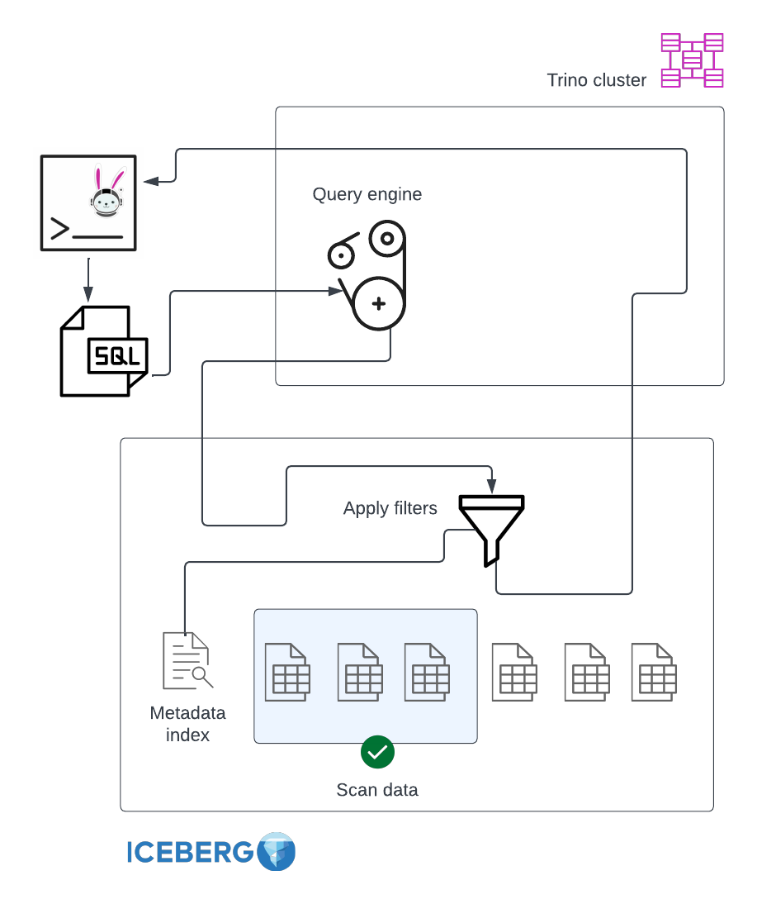
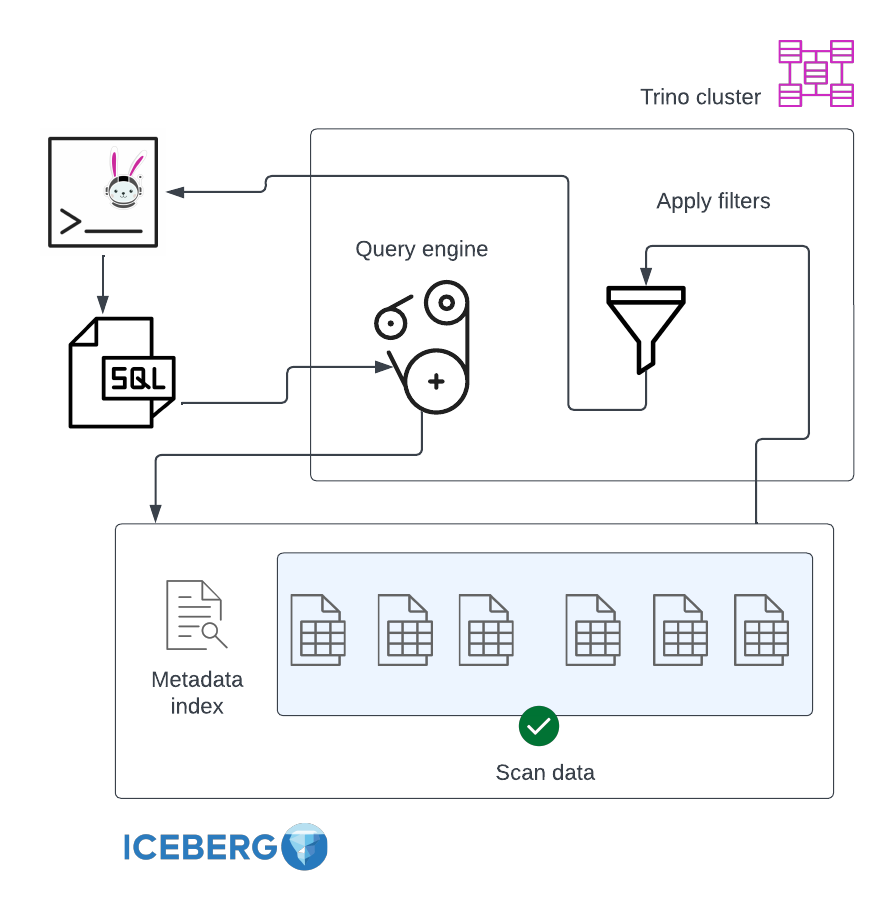
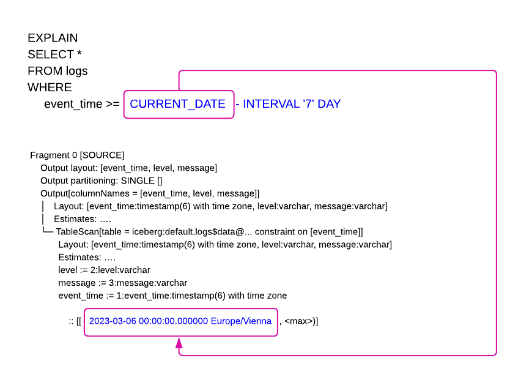

# TABLE_A Trino 쿼리 가이드

### 목차

- [1. 이 문서의 목적](#1-이-문서의-목적) — 대상 독자, 범위
- [2. TABLE_A 구조 요약](#2-table_a-구조-요약) — WHERE 컬럼 역할, 3단계 필터링 원리
- [3. ts 컬럼 필터링 방법](#3-ts-컬럼-필터링-방법) — 날짜/시간 필터 패턴, 등가/범위 조건
- [4. WHERE 조건별 성능 효과](#4-where-조건별-성능-효과) — 필수 컬럼별 최적화 효과
- [5. 쿼리 패턴 가이드](#5-쿼리-패턴-가이드) — 올바른 쿼리 템플릿, 실전 패턴
- [6. 잘못된 쿼리 패턴](#6-잘못된-쿼리-패턴) — 흔한 실수와 교정
- [7. 성능 확인 방법](#7-성능-확인-방법) — EXPLAIN ANALYZE 간이 가이드
- [8. 용어집](#8-용어집)

> **테이블 설계 상세**: [iceberg-schema-design-guide.md](iceberg-schema-design-guide.md) 참조

---

## 1. 이 문서의 목적

이 문서는 **Trino를 통해 Iceberg 테이블을 조회하는 사용자**가 올바른 쿼리를 작성할 수 있도록 안내한다.

이 가이드는 특정 테이블이 아닌 **Iceberg 테이블 전체**를 대상으로 한다. 주요 대상은 기존 Hive 테이블에서 수직분할된 4개 테이블(A, B, C, D)이며, 각 테이블의 일일 데이터 크기는 600GB~900GB이다.

4개 테이블은 기준정보 컬럼(`ts`, `par_a`, `sort_a`, `sort_c` 등)과 쿼리 패턴이 동일하다. 차이는 array 타입 컬럼뿐이며, 이 컬럼들은 WHERE 절 필터링에 사용되지 않으므로 **이 가이드의 모든 내용이 4개 테이블에 동일하게 적용**된다.

WHERE 조건을 어떻게 작성하느냐에 따라 읽기 성능이 크게 달라진다. 조건을 잘못 쓰면 **결과가 조회되지 않거나**, 불필요한 데이터를 전부 읽어 **쿼리가 수 배 느려진다.**

---

## 2. TABLE_A 구조 요약

### 2.1 WHERE 컬럼 역할

| 컬럼 | 타입 | 성능 최적화 역할 | WHERE 필수 |
|------|------|----------------|-----------|
| ts | timestamp_ntz | Partition Pruning (hour 단위) | **필수** |
| par_a | string | Partition Pruning (identity) | **필수** |
| sort_a | string | Data Skipping (Sort Order 1순위) | **필수** |
| sort_c | string | Data Skipping (Sort Order 2순위) | **필수** |
| par_b | string | Row-level Filter | 선택 |
| sort_b | string | Row-level Filter | 선택 |

- **WHERE 필수**: [Partition Pruning](https://iceberg.apache.org/docs/latest/partitioning/)(파티션 단위 건너뛰기) 또는 Data Skipping(파일 단위 건너뛰기)에 해당하는 컬럼. 빠뜨리면 성능이 크게 저하된다
- **선택**: 결과 필터링에 사용되지만, 파티션/파일 단위 최적화에는 영향 없음

### 2.2 3단계 필터링 원리

쿼리가 실행되면 데이터는 3단계로 걸러진다. 앞 단계에서 많이 걸러낼수록 빠르다.

**WHERE 조건이 올바를 때** (이미지 출처: [Trino Blog — Date Predicates](https://trino.io/blog/2023/04/11/date-predicates.html))



> WHERE 조건이 올바르면 Metadata Index에서 먼저 필터링(Apply filters)하여 **조건에 해당하는 파일만 읽는다** (파란색 파일만 Scan).

**WHERE 조건이 부실할 때**



> WHERE 조건이 없거나 부실하면 **모든 파일을 읽은 후** 필터링한다. 읽는 데이터량이 크게 증가하여 쿼리가 느려진다.

**3단계 필터링 상세**

```
1단계: Partition Pruning (파티션 단위)
  ── ts 조건으로 해당 시간대의 파티션만 선택
  ── par_a 조건으로 해당 값의 파티션만 선택
  ── 나머지 파티션은 아예 읽지 않음

2단계: Data Skipping (파일 단위)
  ── 선택된 파티션 내에서 sort_a, sort_c 조건으로
     파일의 min/max 통계를 확인하여 불필요한 파일 건너뛰기

3단계: Row-level Filter (행 단위)
  ── 읽은 파일 내에서 모든 WHERE 조건으로 행 단위 필터링
  ── par_b, sort_b 등 나머지 조건은 이 단계에서 작동
```

> **[Hidden Partitioning](https://iceberg.apache.org/docs/latest/partitioning/)**: Iceberg는 사용자가 원본 컬럼(`ts`, `par_a`)으로 WHERE 조건만 작성하면, 내부 파티션 구조(`hour(ts)`)를 자동으로 이용해 Partition Pruning을 수행한다. 파티션 구조를 알 필요 없이 원본 컬럼으로 쿼리하면 된다.

---

## 3. ts 컬럼 필터링 방법

ts 컬럼은 `timestamp_ntz` 타입이다. `timestamp_ntz`는 시간대(timezone) 정보가 없는 타임스탬프로, 저장된 값 그대로 비교된다.

### 3.1 ts에 `=` 등가 비교를 직접 사용하면 안 되는 이유

```sql
-- ❌ 결과 없음
WHERE ts = DATE '2026-03-18'
WHERE ts = TIMESTAMP '2026-03-18'
```

위 두 조건 모두 결과가 조회되지 않는다. 원인은 다음과 같다.

**`ts = TIMESTAMP '2026-03-18'`**

Trino에서 [`TIMESTAMP '2026-03-18'`은 `TIMESTAMP '2026-03-18 00:00:00.000000'`과 동일](https://trino.io/docs/current/functions/datetime.html)하다. 즉 ts 값이 **2026-03-18 자정(00:00:00.000000)에 마이크로초 단위로 정확히 일치하는 행**만 매칭한다. 실제 데이터는 하루 중 다양한 시각(10:15:32, 14:22:01 등)에 분포하므로 자정에 정확히 일치하는 행이 없어 결과가 없다.

**`ts = DATE '2026-03-18'`**

ts는 `timestamp_ntz` 타입이고 `DATE '2026-03-18'`은 `date` 타입이다. Trino는 비교 시 [DATE를 TIMESTAMP로 암묵적 변환(implicit cast)](https://trino.io/docs/current/functions/comparison.html)하며, 이때 시간 부분은 0으로 채워진다. 즉 `DATE '2026-03-18'`이 `TIMESTAMP '2026-03-18 00:00:00.000000'`으로 변환되어 위와 동일한 자정 정밀 매칭 문제로 결과가 없다.

**해결**: [`date()`](https://trino.io/docs/current/functions/datetime.html) 함수 또는 범위 조건을 사용한다.

```sql
-- ✅ 날짜 조회
WHERE date(ts) = DATE '2026-03-18'

-- ✅ 범위 조회 (ts 직접 사용 가능 — 범위 비교는 정상 작동)
WHERE ts >= TIMESTAMP '2026-03-18 00:00:00'
  AND ts <  TIMESTAMP '2026-03-19 00:00:00'
```

> **`=` 등가 비교만 문제**이다. `>=`, `<`, `BETWEEN` 등 **범위 비교에서는 ts 컬럼을 직접 사용해도 정상 작동**한다. 범위 비교는 마이크로초 정밀 매칭이 아니라 구간에 포함되는 모든 행을 반환하기 때문이다.

### 3.2 날짜 필터 — 등가 조건

시간 정보 없이 **날짜만 알 때** 사용한다.

```sql
-- 방법 1: date() 함수 (권장 — 가장 간결)
WHERE date(ts) = DATE '2026-03-11'

-- 방법 2: CAST (date()와 동일 — date()는 CAST(x AS date)의 alias)
WHERE CAST(ts AS DATE) = DATE '2026-03-11'

-- 방법 3: date_trunc
WHERE date_trunc('day', ts) = TIMESTAMP '2026-03-11 00:00:00'
```

세 방식 모두 Trino가 내부적으로 timestamp 범위 조건으로 변환하여 **Partition Pruning이 동일하게 작동**한다 ([Trino 블로그: Just the right time date predicates with Iceberg](https://trino.io/blog/2023/04/11/date-predicates.html)). `date()`는 [`CAST(x AS date)`의 alias](https://trino.io/docs/current/functions/datetime.html)이므로 방법 1과 2는 완전히 동일하다. 성능 차이가 없으므로 가장 간결한 `date(ts)`를 권장한다.

**Constant Folding** (이미지 출처: [Trino Blog — Date Predicates](https://trino.io/blog/2023/04/11/date-predicates.html))



> Trino는 쿼리 계획 시점에 `CURRENT_DATE` 같은 상수 표현식을 **구체적인 timestamp 값으로 변환**(Constant Folding)한다. 위 예시에서 `CURRENT_DATE - INTERVAL '7' DAY`가 `2023-03-06 00:00:00.000000`으로 변환되어 Iceberg의 Partition Pruning에 전달된다. `date(ts) = DATE '...'`, `date_trunc('day', ts) = TIMESTAMP '...'` 등의 날짜 함수 조건은 Predicate Unwrapping이라는 별도 최적화로 timestamp 범위 조건으로 변환된다.

> 날짜 조건은 해당일의 24개 시간 파티션을 모두 스캔한다. 이는 정상 동작이며 Partition Pruning이 작동하는 것이다 (전체 날짜를 스캔하는 것이 아니라 해당일만 스캔).

### 3.3 날짜 필터 — 범위 조건

여러 날을 조회할 때 사용한다.

```sql
-- 범위 (2일간)
WHERE date(ts) >= DATE '2026-03-11'
  AND date(ts) <= DATE '2026-03-12'

-- BETWEEN (위와 동일)
WHERE date(ts) BETWEEN DATE '2026-03-11' AND DATE '2026-03-12'

-- IN (비연속 날짜)
WHERE date(ts) IN (DATE '2026-03-11', DATE '2026-03-15')
```

모두 Trino가 내부적으로 timestamp 범위 조건으로 변환하여 [Partition Pruning이 작동](https://trino.io/blog/2023/04/11/date-predicates.html)한다. 범위에 포함된 날짜의 시간 파티션만 스캔한다.

### 3.4 시간 필터 — 등가 조건

**특정 시간대**를 정확히 조회할 때 사용한다. 1개 시간 파티션만 스캔하므로 **가장 효율적**이다.

```sql
-- 방법 1: date_trunc (권장 — 간결)
WHERE date_trunc('hour', ts) = TIMESTAMP '2026-03-11 10:00:00'

-- 방법 2: ts 범위 조건 (동일 효과)
WHERE ts >= TIMESTAMP '2026-03-11 10:00:00'
  AND ts <  TIMESTAMP '2026-03-11 11:00:00'
```

[`date_trunc('hour', ts)`](https://trino.io/docs/current/functions/datetime.html)는 ts의 분/초를 버리고 시간 단위로 잘라낸다. Trino가 이를 범위 조건으로 변환하여 Partition Pruning이 작동한다 ([Trino 블로그](https://trino.io/blog/2023/04/11/date-predicates.html)).

### 3.5 시간 필터 — 범위 조건

여러 시간대를 연속으로 조회할 때 사용한다.

```sql
-- 08시~12시 (5개 시간 파티션 스캔: 08, 09, 10, 11, 12)
WHERE ts >= TIMESTAMP '2026-03-11 08:00:00'
  AND ts <  TIMESTAMP '2026-03-11 13:00:00'
```

> 시간 범위 조건은 `>=` + `<` 패턴을 권장한다. `BETWEEN`은 양쪽 끝을 포함하므로 끝 시각을 정확히 지정하기 어렵다 (예: `12:59:59`로 지정하면 `12:59:59.000001~12:59:59.999999` 구간의 데이터가 누락된다).

### 3.6 시간 필터 — 비연속 조건

연속되지 않는 특정 시간대를 조회할 때 사용한다.

```sql
-- 10시, 14시, 18시 (3개 시간 파티션만 스캔)
WHERE date_trunc('hour', ts) IN (
    TIMESTAMP '2026-03-11 10:00:00',
    TIMESTAMP '2026-03-11 14:00:00',
    TIMESTAMP '2026-03-11 18:00:00'
)
```

IN 절의 각 시간에 해당하는 파티션만 스캔한다.

### 3.7 ts 필터 패턴 요약

| 상황 | 권장 패턴 | Partition Pruning | 스캔 범위 |
|------|----------|-------------------|----------|
| 날짜 1일 | `date(ts) = DATE '...'` | ✅ | 24개 시간 파티션 |
| 날짜 N일 | `date(ts) BETWEEN DATE '...' AND DATE '...'` | ✅ | N×24개 시간 파티션 |
| 비연속 날짜 | `date(ts) IN (DATE '...', ...)` | ✅ | 해당 날짜의 시간 파티션 |
| 시간 1시간 | `date_trunc('hour', ts) = TIMESTAMP '...'` | ✅ | **1개** 시간 파티션 |
| 시간 범위 | `ts >= TIMESTAMP '...' AND ts < TIMESTAMP '...'` | ✅ | 해당 시간 파티션 |
| 비연속 시간 | `date_trunc('hour', ts) IN (TIMESTAMP '...', ...)` | ✅ | 해당 시간 파티션 |
| ts `=` 등가 | `ts = TIMESTAMP '...'` / `ts = DATE '...'` | ❌ | **결과 없음** (3.1절 참조) |

---

## 4. WHERE 조건별 성능 효과

### 4.1 필수 컬럼 (Partition Pruning / Data Skipping)

| 컬럼 | 최적화 단계 | 포함 시 효과 | 빠뜨릴 때 영향 |
|------|-----------|------------|--------------|
| ts | Partition Pruning | 해당 시간/날짜의 파티션만 스캔. 날짜 조건 시 24개 시간 파티션, 시간 조건 시 1개 파티션만 읽음 | **전체 날짜 스캔** — 모든 시간 파티션의 데이터를 읽음 |
| par_a | Partition Pruning | 해당 값의 파티션만 스캔. par_a는 4개 값(A/B/C/D)이나 **데이터 분포가 균등하지 않다** (실측: B 43.4%, C 43.1%, A 12.4%, D 1.0%). par_a = 'D' 조건 시 전체의 1%만 스캔하고, par_a = 'B' 조건 시 43.4%를 스캔 | par_a 조건 없으면 **4개 파티션 전체를 읽어** 스캔량이 크게 증가 |
| sort_a | Data Skipping | 파일마다 저장된 sort_a의 min/max 통계를 WHERE 값과 비교하여, 조건에 해당하지 않는 파일을 읽지 않고 건너뜀. Sort Order **1순위**이므로 파일별 값 범위가 가장 잘 분리되어 있어 **건너뛰는 파일 수가 가장 많다** | **Data Skipping 무효화** — 파티션 내 모든 파일을 읽음. Sort Order 1순위를 빠뜨리면 2순위(sort_c)의 Data Skipping 효과도 크게 감소 |
| sort_c | Data Skipping | sort_a로 1차 필터링된 파일들 중에서 sort_c의 min/max 통계로 **추가 파일을 건너뜀**. Sort Order **2순위**이므로 1순위(sort_a)만큼 파일 범위가 명확하게 분리되지는 않으나, 추가 건너뛰기 효과를 제공 | sort_c 단독 누락 시 영향은 sort_a 누락보다 작음. 1순위 sort_a의 Data Skipping은 유지됨 |

### 4.2 선택 컬럼 (Row-level Filter)

| 컬럼 | 최적화 단계 | 효과 |
|------|-----------|------|
| par_b | Row-level Filter | 파티션/Sort Order에 포함되지 않으므로 **파티션/파일 단위 건너뛰기는 발생하지 않는다**. 파일을 읽은 후 행 단위로 조건에 맞는 행만 반환 |
| sort_b | Row-level Filter | 동일. Sort Order에 포함되지 않음 |

---

## 5. 쿼리 패턴 가이드

### 5.1 기본 쿼리 — 날짜 조건

```sql
SELECT *
FROM TABLE_A
WHERE date(ts) = DATE '2026-03-11'
  AND par_a = 'A'
  AND sort_a = 'value1'
  AND sort_c = 'value3';
```

### 5.2 기본 쿼리 — 시간 조건

시간 정보를 알고 있다면 시간 조건이 **가장 효율적**이다 (1개 시간 파티션만 스캔).

```sql
SELECT *
FROM TABLE_A
WHERE date_trunc('hour', ts) = TIMESTAMP '2026-03-11 10:00:00'
  AND par_a = 'A'
  AND sort_a = 'value1'
  AND sort_c = 'value3';
```

### 5.3 기타 패턴

ts 필터의 다양한 패턴(날짜 범위, 시간 범위, IN 절, 비연속 시간 등)은 [3절](#3-ts-컬럼-필터링-방법)을 참조하여 WHERE 절을 구성한다. 아래는 par_a IN 절 예시이다.

```sql
-- par_a 복수 값 조회
SELECT *
FROM TABLE_A
WHERE date(ts) = DATE '2026-03-11'
  AND par_a IN ('A', 'B')
  AND sort_a = 'value1'
  AND sort_c = 'value3';
```

### 5.4 SELECT 절 권장사항

```sql
-- 권장: 필요한 컬럼만 명시
SELECT ts, par_a, sort_a, val_1
FROM TABLE_A
WHERE ...;

-- 비권장: 전체 컬럼
SELECT *
FROM TABLE_A
WHERE ...;
```

Trino는 SELECT 절에 명시된 컬럼만 스토리지에서 읽는 [Projection Pushdown](https://trino.io/docs/current/optimizer/pushdown.html)을 수행한다. TABLE_A는 컬럼 단위로 데이터를 저장하는 Parquet 포맷이므로, `SELECT *`는 19개 컬럼 전체를 읽지만 필요한 컬럼만 명시하면 해당 컬럼의 데이터만 스토리지에서 읽어 **I/O가 감소**한다.

**Parquet 파일 구조** (이미지 출처: [Apache Parquet Format](https://github.com/apache/parquet-format))


> Parquet는 Row Group 내에서 **컬럼별로 데이터를 분리 저장**(Column Chunk)한다. SELECT에 명시된 컬럼의 Column Chunk만 읽으므로 불필요한 컬럼의 I/O가 발생하지 않는다.

---

## 6. 잘못된 쿼리 패턴

### 6.1 ts `=` 등가 비교 — 결과 없음

```sql
-- ❌ 결과 없음
WHERE ts = TIMESTAMP '2026-03-18'
WHERE ts = DATE '2026-03-18'

-- ✅ 올바른 패턴
WHERE date(ts) = DATE '2026-03-18'
```

> 원인과 해결 방법은 [3.1절](#31-ts에-등가-비교를-직접-사용하면-안-되는-이유) 참조.

### 6.2 ts 조건 누락 — 전체 날짜 스캔

```sql
-- ❌ ts 조건 없음 → 모든 날짜 데이터를 읽음
WHERE par_a = 'A'
  AND sort_a = 'value1'
  AND sort_c = 'value3';

-- ✅ 올바른 패턴
WHERE date(ts) = DATE '2026-03-11'
  AND par_a = 'A'
  AND sort_a = 'value1'
  AND sort_c = 'value3';
```

> ts는 `hour(ts)` [Partition Pruning](https://iceberg.apache.org/docs/latest/partitioning/)의 대상이다. ts 조건이 없으면 Iceberg가 시간 파티션을 걸러낼 수 없어 **존재하는 모든 날짜의 데이터를 읽는다.**

### 6.3 par_a 조건 누락 — 전체 파티션 스캔

```sql
-- ❌ par_a 조건 없음 → 모든 par_a 파티션을 읽음
WHERE date(ts) = DATE '2026-03-11'
  AND sort_a = 'value1'
  AND sort_c = 'value3';

-- ✅ 올바른 패턴
WHERE date(ts) = DATE '2026-03-11'
  AND par_a = 'A'
  AND sort_a = 'value1'
  AND sort_c = 'value3';
```

> par_a는 identity [Partition Pruning](https://iceberg.apache.org/docs/latest/partitioning/)의 대상이다. 조건을 빠뜨리면 **4개 par_a 파티션(A/B/C/D)을 모두 읽는다.** 데이터 분포와 스캔량 영향은 [4.1절](#41-필수-컬럼-partition-pruning--data-skipping) 참조.

### 6.4 sort_a/sort_c 조건 누락 — Data Skipping 무효화

```sql
-- ❌ sort_a, sort_c 없음 → 파티션 내 모든 파일을 읽음
WHERE date(ts) = DATE '2026-03-11'
  AND par_a = 'A';

-- ✅ 올바른 패턴
WHERE date(ts) = DATE '2026-03-11'
  AND par_a = 'A'
  AND sort_a = 'value1'
  AND sort_c = 'value3';
```

> sort_a, sort_c는 Data Skipping의 대상이다. 데이터가 Sort Order(`sort_a`, `sort_c`)로 정렬되어 있어 파일마다 min/max 통계가 저장되어 있다. 이 조건이 없으면 Iceberg가 **파일의 min/max 통계를 활용할 수 없어 파티션 내 모든 파일을 읽는다.**

### 6.5 파티션 컬럼에 함수 적용 — Partition Pruning 무효화

```sql
-- ❌ par_a에 함수 적용 → Partition Pruning 작동 안 함
WHERE UPPER(par_a) = 'A'

-- ✅ 원본 값으로 비교
WHERE par_a = 'A'
```

> 파티션 컬럼(`par_a`)에 함수를 적용하면, Iceberg가 WHERE 값을 파티션 값과 매칭할 수 없어 [Partition Pruning](https://iceberg.apache.org/docs/latest/partitioning/)이 무효화된다. 원본 값으로 비교해야 한다.
>
> 단, `ts` 컬럼의 `date()`, `date_trunc()`는 예외이다. Trino가 이 함수들을 **timestamp 범위 조건으로 자동 변환**하여 Partition Pruning이 정상 작동한다 ([Trino 블로그](https://trino.io/blog/2023/04/11/date-predicates.html)).

---

## 7. 성능 확인 방법

쿼리 앞에 [`EXPLAIN ANALYZE`](https://trino.io/docs/current/sql/explain-analyze.html)를 붙이면 실제 실행 후 성능 지표를 확인할 수 있다.

```sql
EXPLAIN ANALYZE
SELECT *
FROM TABLE_A
WHERE date(ts) = DATE '2026-03-11'
  AND par_a = 'A'
  AND sort_a = 'value1'
  AND sort_c = 'value3';
```

**확인할 지표 2가지** ([EXPLAIN ANALYZE 공식 문서](https://trino.io/docs/current/sql/explain-analyze.html))

| 지표 | 의미 | 좋은 상태 |
|------|------|----------|
| **Physical input** | 스토리지에서 실제 읽은 데이터 크기 | 적을수록 좋음 — Partition Pruning/Data Skipping이 잘 작동한 것 |
| **Filtered** | 읽은 후 버린 행의 비율 (%) | 낮을수록 좋음 — 불필요한 데이터를 적게 읽은 것 |

`Physical input`이 크고 `Filtered`가 높다면 WHERE 조건에서 필수 컬럼(ts, par_a, sort_a, sort_c)을 확인해야 한다.

> **상세 해석 방법**: [read-performance-test.md](read-performance-test.md)의 "EXPLAIN ANALYZE 결과 해석 가이드" 참조

---

## 8. 용어집

| 용어 | 설명 |
|------|------|
| **[Partition Pruning](https://iceberg.apache.org/docs/latest/partitioning/)** | 쿼리 조건과 무관한 파티션(데이터 그룹)을 읽지 않고 건너뛰는 최적화. WHERE 절의 파티션 컬럼 조건(`ts`, `par_a`)으로 작동한다 |
| **Data Skipping** | 파일의 min/max 통계를 보고, 조건에 해당하지 않는 파일을 건너뛰는 최적화. Sort Order(`sort_a`, `sort_c`)로 데이터가 정렬되어 있을 때 효과가 높다 |
| **Sort Order** | 데이터 파일을 쓸 때 지정된 컬럼 순서로 정렬하는 설정. 정렬된 파일은 min/max 범위가 좁아져 Data Skipping 효과가 높아진다 |
| **[Hidden Partitioning](https://iceberg.apache.org/docs/latest/partitioning/)** | Iceberg의 파티셔닝 방식. 사용자는 원본 컬럼(`ts`)으로 쿼리하면 되고, 내부적으로 파티션(`hour(ts)`)을 이용해 Partition Pruning이 자동 수행된다 |
| **timestamp_ntz** | 시간대(timezone) 정보가 없는 타임스탬프 타입. 저장된 값 그대로 비교된다 |
| **[Row Group](https://parquet.apache.org/docs/concepts/)** | Parquet 파일 내부의 행 묶음 단위. min/max 통계가 Row Group별로 저장되어 Data Skipping에 활용된다 |
| **Compaction** | 여러 개의 작은 파일을 적정 크기의 큰 파일로 병합하는 운영 작업. 정기적으로 수행된다 |
